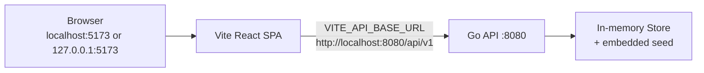
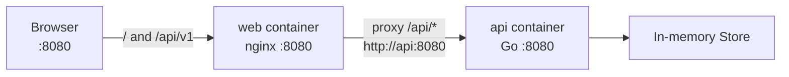

# Smart CA

CA Practice Management System — React frontend + Go REST API (in-memory demo backend).

| | |
|---|---|
| **Workspace** | `D:\SmartCA\` → `Go\` (API) + `saas\` (UI) |
| **Status** | Demo-ready for local walkthroughs |
| **Database** | Concurrency-safe **in-memory** store + deterministic embedded seed |
| **PostgreSQL** | **Not implemented** (repository interface ready for future swap) |
| **Docker** | Dockerfiles + Compose **provided and statically reviewed** |
| **Docker runtime** | **NOT verified locally** — Docker cannot run on the authoring machine |

---

## Overview

Smart CA helps a CA practice manage clients, companies, compliance (GST / ITR / TDS / ROC), invoicing, payments, documents metadata, tasks, calendar, accounting demo journals, reports, users/roles, and settings.

The browser talks to a Go REST API. Business data is **not** owned by LocalStorage or static mock JSON on the verified production path.

---

## Current Project Status

| Area | Reality |
|------|---------|
| React + TypeScript frontend | Exists (`saas/`) |
| Go REST API | Exists (`Go/`) |
| Frontend → Go API binding | Verified for core business modules (native QA) |
| Data store | In-memory only |
| Seed data | Deterministic JSON embedded via `go:embed` |
| Runtime CRUD | Survives browser refresh; **lost on API process restart** |
| PostgreSQL / Redis / object storage | **Not present** |
| Real AI | Simulated / canned replies |
| Docker images / Compose up | **NOT RUN** in this environment |

---

## Key Features (from source)

- Authentication (opaque Bearer sessions), RBAC permissions
- Dashboard & reports calculated from backend state
- Clients, companies, employees CRUD + archive/restore patterns
- Invoices & payments with server-side money (paise) and GST-aware totals
- Documents metadata (no real object storage)
- Tasks, compliance modules (GST/ITR/TDS/ROC), notes, calendar
- Accounting demo (journals, trial balance, P&L, balance sheet)
- Settings, users, roles, notifications, recycle bin, global search
- Demo reset (`POST /api/v1/demo/reset`) for `super_admin` when enabled

---

## Technology Stack (exact)

| Layer | Technology | Version source |
|-------|------------|----------------|
| Backend language | Go | `go.mod` → **1.26.5** |
| HTTP router | chi | `github.com/go-chi/chi/v5 v5.3.1` |
| Crypto | golang.org/x/crypto | `v0.54.0` (bcrypt) |
| Frontend | React | `package.json` → **^19.2.7** |
| Bundler | Vite | **^8.1.1** |
| Language | TypeScript | **~6.0.2** |
| CSS | Tailwind CSS | **^4.3.2** (`@tailwindcss/vite`) |
| Data fetching | TanStack Query | **^5.101.2** |
| Client state | Zustand | **^5.0.14** |
| Routing | react-router | **^7.18.1** |
| Forms | react-hook-form + zod | ^7.81.0 / ^4.4.3 |
| Charts | recharts | ^3.9.2 |
| Package manager | **npm** (`package-lock.json` present) |
| Node (local verify) | **v22.20.0** | — |
| npm (local verify) | **10.5.0** | — |

---

## System Architecture

### Native development



### Intended Docker deployment



**Important:** Browser JavaScript must **not** use Compose DNS names (`api`, `web`). Production builds use **`VITE_API_BASE_URL=/api/v1`** (same-origin). Nginx proxies `/api/` to `http://api:8080`.

---

## Repository Structure

```
D:\SmartCA\
├── README.md                 # This file (full-stack)
├── docker-compose.yml        # api + web (workspace root)
├── Docker_Static_Review_Report.txt
├── Go\                       # Separate Git repo (often no remote)
│   ├── Dockerfile
│   ├── .dockerignore
│   ├── cmd\api\              # main entrypoint
│   ├── internal\             # handlers, services, memory store, seed
│   ├── pkg\apiresponse\
│   ├── docs\
│   └── README.md
└── saas\                     # GitHub: JagtapAvadhut/SmartCA
    ├── Dockerfile
    ├── .dockerignore
    ├── nginx.conf
    ├── src\
    └── README.md
```

Git boundaries: **`Go`** and **`saas`** are separate repositories. Parent folder is **not** a Git repo.

---

## Frontend Architecture

React 19 + TypeScript + Vite 8. Feature pages under `src/pages/*`. API access via `src/services/httpClient.ts` (Bearer token in `localStorage` key `smart-ca-token`). TanStack Query for server state; Zustand for UI/auth shell. React Router SPA.

---

## Backend Architecture

```
HTTP (chi) → Handlers → Application Services → memory.Store (RWMutex + tx snapshots)
```

Auth: bcrypt password hashes, opaque session tokens. RBAC middleware on protected routes. Seed loaded from `internal/seed/data/*.json` via `go:embed`.

---

## Data Storage Model

- Typed collections in process memory
- Deterministic seed on startup
- `POST /api/v1/demo/reset` reloads seed (authorized)
- **No durable volume** in Compose — recreate/restart resets data

---

## Authentication and Authorization

| Item | Behavior |
|------|----------|
| Login | `POST /api/v1/auth/login` `{ identifier, password, rememberMe?, device? }` |
| Identifier | email **or** username **or** loginId |
| Session | Opaque Bearer token |
| Me | `GET /api/v1/auth/me` |
| Logout | `POST /api/v1/auth/logout` |

### Demo credentials (intentional public demo)

Password for seeded users: **`SmartCA@2025`** (bcrypt at seed load; never returned by API).

| Label | Email |
|-------|-------|
| Admin | `rajesh.sharma@smartca.in` |
| Partner | `priya.patel@smartca.in` |
| CA (UI label) | `amit.kumar@smartca.in` |

CORS: `FRONTEND_ORIGIN` allowlist. `localhost` ≠ `127.0.0.1`.

---

## API Overview

Base path: **`/api/v1`**

| Probe | Path |
|-------|------|
| Liveness | `GET /health/live` |
| Readiness | `GET /health/ready` |
| Version | `GET /api/v1/version` |

OpenAPI (partial vs mounted routes): `Go/docs/openapi.yaml`

Major groups: auth, clients, companies, employees, invoices, payments, documents, tasks, compliance/gst/itr/tds/roc, dashboard, reports, accounting, users, roles, settings, notifications, search, archive/recycle, demo reset.

---

## Environment Variables

### Backend (`Go`)

| Variable | Purpose | Required | Default | Native | Docker |
|----------|---------|----------|---------|--------|--------|
| `APP_ENV` | Environment label | no | `development` | `development` | `production` |
| `HTTP_HOST` | Bind host | no | `0.0.0.0` | `0.0.0.0` | `0.0.0.0` |
| `HTTP_PORT` | Listen port | no | `8080` | `8080` | `8080` (internal) |
| `FRONTEND_ORIGIN` | CORS allowlist | yes | localhost+127.0.0.1 `:5173` | Vite origins | `http://localhost:8080,http://127.0.0.1:8080` |
| `FRONTEND_ORIGINS` | Alias override | no | unset | optional | optional |
| `LOG_LEVEL` | Logging | no | `info` | `info` | `info` |
| `SESSION_TTL` | Session TTL | no | `30m` | `30m` | `30m` |
| `DEMO_RESET_ENABLED` | Demo reset | no | true in dev | `true` | `true` |

### Frontend (`saas`) — build-time `VITE_*` only

| Variable | Purpose | Required | Default | Native | Docker build |
|----------|---------|----------|---------|--------|--------------|
| `VITE_API_BASE_URL` | API prefix | no | `http://localhost:8080/api/v1` | absolute host URL | `/api/v1` |
| `VITE_APP_NAME` | Product name | no | `Smart CA` | `Smart CA` | `Smart CA` |

---

## Native Development Setup

### Prerequisites

- Go **1.26.5**
- Node **22.x** + npm (lockfile-based)
- No database server

### Backend

```bash
cd Go
cp .env.example .env   # optional
go run ./cmd/api
```

Verify: `GET http://127.0.0.1:8080/health/live`

### Frontend

```bash
cd saas
cp .env.example .env   # VITE_API_BASE_URL=http://localhost:8080/api/v1
npm ci
npm run dev
```

Open `http://localhost:5173` or `http://127.0.0.1:5173`.

### QA (native)

```bash
# API + Vite must be running
cd saas
npm run qa:auth
npm run qa:business
npm run qa:browser
```

---

## Docker Deployment Configuration

Files:

| File | Role |
|------|------|
| `docker-compose.yml` | `api` + `web` services |
| `Go/Dockerfile` | Multi-stage Go binary → distroless nonroot |
| `Go/.dockerignore` | Lean build context |
| `saas/Dockerfile` | `npm ci` + `npm run build` → nginx unprivileged |
| `saas/.dockerignore` | Lean build context |
| `saas/nginx.conf` | SPA + `/api/` reverse proxy + `/health` |

### Intended commands (Docker-capable host only)

```bash
cd D:\SmartCA
docker compose build
docker compose up -d
docker compose ps
docker compose logs -f
docker compose down
```

**These commands were NOT executed in the current environment.** They are the intended interface of the checked-in configuration.

Published UI: **http://localhost:8080**  
API: internal only (`api:8080`); browser uses **/api/v1** via nginx.

---

## Docker Networking

| Context | API URL |
|---------|---------|
| Native Vite | `http://localhost:8080/api/v1` (or 127.0.0.1) |
| Docker browser | `/api/v1` (same origin as web) |
| Nginx → Go | `http://api:8080` (Compose DNS) |

---

## Health Checks

| Service | Endpoint | Compose check | Runtime verified? |
|---------|----------|---------------|-------------------|
| api | `GET /health/live` | `smartca-api -healthcheck` | **NO** (Docker not run) |
| web | `GET /health` → `ok` | `wget` to `:8080/health` | **NO** |

Source endpoints exist and are exercised in native Go tests / curl where noted in the static review report.

---

## Testing (executed without Docker)

See `Docker_Static_Review_Report.txt` for the latest recorded results in this pass.

Typical commands:

```bash
# Go
cd Go
go vet ./...
go test ./...
go build -o smartca-api.exe ./cmd/api

# Frontend
cd saas
npx tsc -b --pretty false
npm run build
npm run lint   # oxlint, if used
```

`go test -race` requires CGO/toolchain support — may be unavailable on Windows without gcc.

---

## Demo Data Behavior

- Startup loads embedded seed
- Mutations live in RAM
- API restart → seed again
- Compose recreate → seed again
- `POST /api/v1/demo/reset` → atomic reload for authorized admin

---

## Known Limitations

1. No PostgreSQL / durable persistence
2. API restart wipes runtime CRUD
3. No real object storage for documents
4. AI replies simulated
5. **Docker build/run/Compose not verified on this machine**
6. OpenAPI may lag mounted routes
7. Accounting is demo-grade, not statutory certification

---

## Future PostgreSQL Migration

Swap `memory.Store` implementations behind repository interfaces; keep handlers/services. Blueprint: `Go/docs/POSTGRESQL_MIGRATION_BLUEPRINT.md`.

---

## Troubleshooting

| Symptom | Likely cause |
|---------|----------------|
| Failed to fetch (native) | API down, or CORS `localhost` vs `127.0.0.1` |
| Login fails in Docker concept | Build used wrong `VITE_API_BASE_URL` (must be `/api/v1`) |
| Wrong port | Native API 8080; Docker UI 8080; Vite 5173 |
| Data disappeared | API/container restart (expected) |
| Compose DNS in browser | Never set `VITE_API_BASE_URL=http://api:8080` |

---

## Security Notes

Demo application. Demo passwords are public by design. In-memory sessions. Not hardened for internet-facing production without durable auth store, TLS termination, secrets management, and a real database.

---

## Documentation

| Document | Path |
|----------|------|
| System status | `SMART_CA_SYSTEM_STATUS.md` / `Go/docs/` / `saas/docs/` |
| Feature ↔ API matrix | `FEATURE_API_TRACEABILITY_MATRIX.md` |
| Auth debug | `Auth_Debug_Report.txt` |
| Docker static review | `Docker_Static_Review_Report.txt` |

---

## License

No `LICENSE` file is present in `Go/`, `saas/`, or the workspace root at the time of writing. Do not assume an open-source license.
