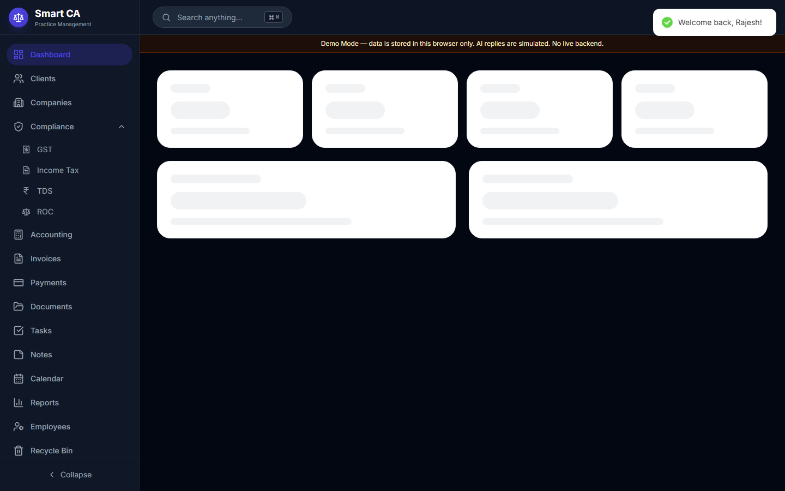
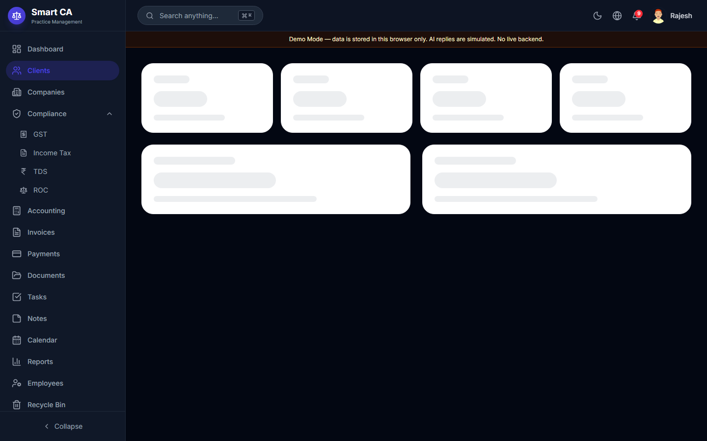
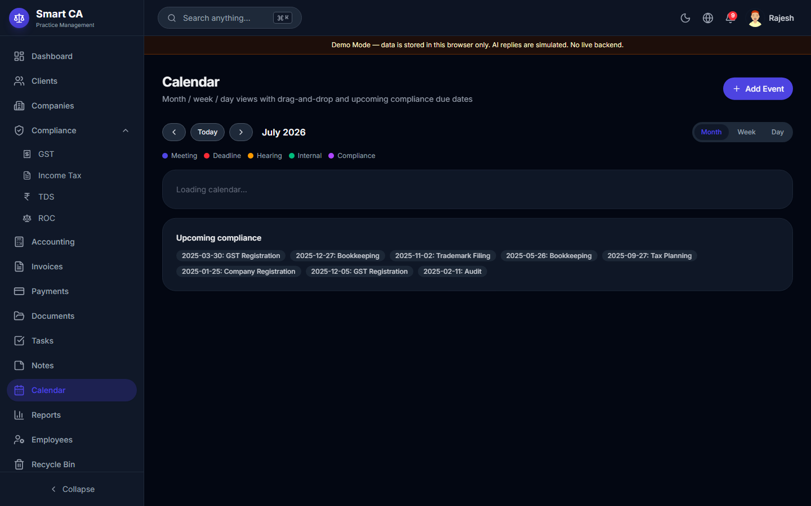
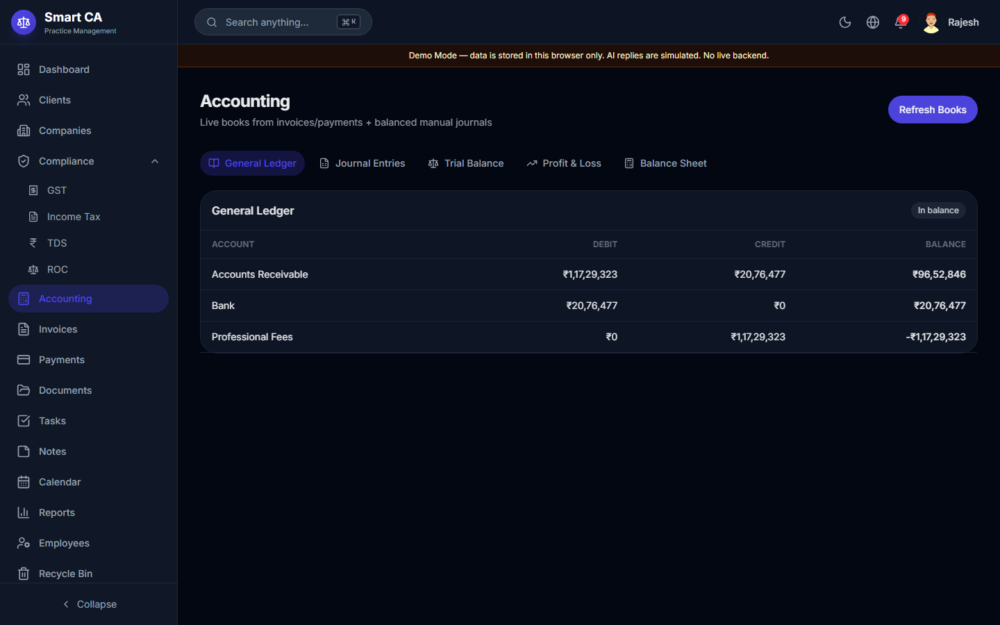
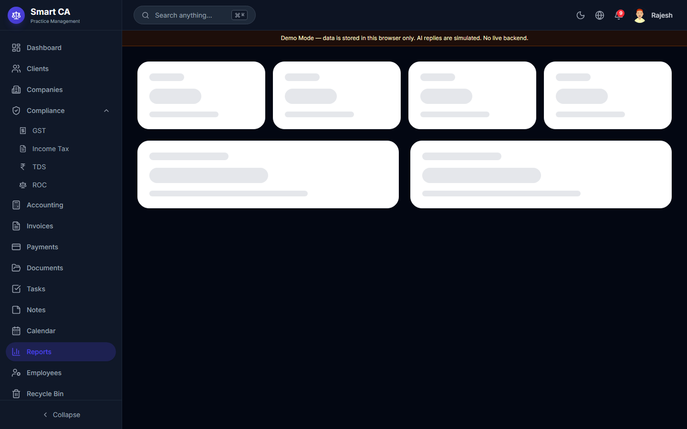
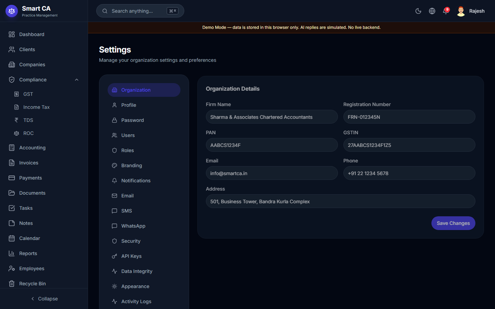
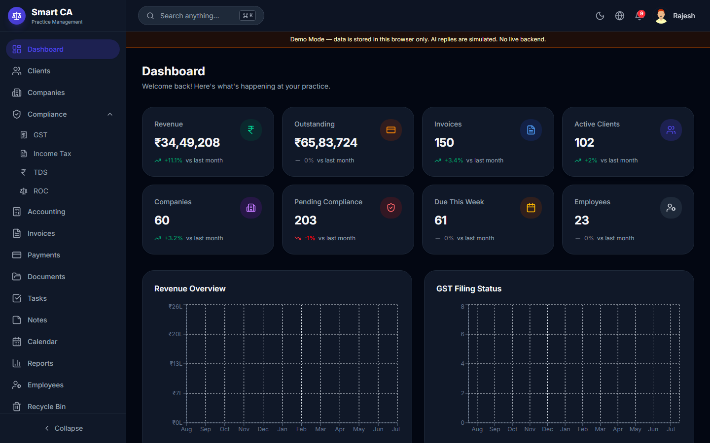
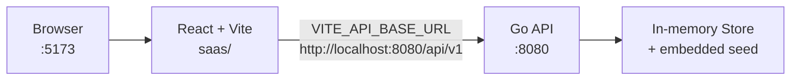
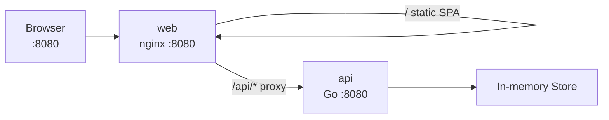

# Smart CA

Chartered Accountant practice management system — **React** frontend + **Go** REST API in a single monorepo.

```
Browser → React (saas) → REST /api/v1 → Go handlers → services → repository interfaces → in-memory store → deterministic seed
```

> **Demo status:** Ready for local walkthroughs. **Not** production-ready for real customer data or statutory filings.  
> **Database:** Concurrency-safe **in-memory** store only. **PostgreSQL is not implemented.**  
> **Docker:** Configuration is provided and statically reviewed. **Docker was NOT runtime-tested on the authoring machine.**

---

## Application Screenshots

















---

## Overview

Smart CA helps a CA firm manage clients, companies, compliance workflows (GST / ITR / TDS / ROC), invoicing, payments, document metadata, tasks, calendar, demo accounting journals, reports, users/roles, and settings.

Business data is owned by the **Go API**. The verified frontend path does **not** use LocalStorage or static JSON as the business database.

---

## Key Features

| Module | Capability |
|--------|------------|
| Auth & RBAC | Opaque Bearer sessions, permission-gated routes/actions |
| Dashboard / Reports | Aggregates from live backend state |
| Clients / Companies / Employees | CRUD + archive/restore patterns |
| Invoices / Payments | Server-side totals, GST-aware money (paise internally) |
| Documents | Metadata CRUD (no real object storage) |
| Tasks / Notes / Calendar | Practice operations |
| Compliance | GST, ITR, TDS, ROC modules |
| Accounting (demo) | Journals, trial balance, P&L, balance sheet |
| Settings / Users / Roles | Admin configuration |
| Search / Recycle Bin / Notifications | Cross-cutting UX |
| Demo reset | `POST /api/v1/demo/reset` (authorized) |

---

## Technology Stack

### Frontend (`saas/`)

| Tech | Version (from `saas/package.json`) |
|------|--------------------------------------|
| React / React DOM | ^19.2.7 |
| Vite | ^8.1.1 |
| TypeScript | ~6.0.2 |
| Tailwind CSS | ^4.3.2 |
| TanStack Query / Table | ^5.101.2 / ^8.21.3 |
| Zustand | ^5.0.14 |
| react-router | ^7.18.1 |
| react-hook-form + zod | ^7.81.0 / ^4.4.3 |
| recharts, framer-motion, lucide-react | as declared |
| Package manager | **npm** (`package-lock.json`) |

### Backend (`Go/`)

| Tech | Version (from `Go/go.mod`) |
|------|----------------------------|
| Go | **1.26.5** |
| chi | v5.3.1 |
| google/uuid | v1.6.0 |
| golang.org/x/crypto | v0.54.0 (bcrypt; pure Go) |

---

## Monorepo Structure

```
SmartCA/
├── Go/                      # Go REST API
│   ├── cmd/api/             # Entrypoint (+ -healthcheck)
│   ├── internal/            # handlers, services, memory store, seed, auth, RBAC
│   ├── pkg/apiresponse/
│   ├── Dockerfile
│   ├── .dockerignore
│   └── README.md
├── saas/                    # React + Vite frontend
│   ├── src/
│   ├── nginx.conf           # SPA + /api reverse proxy (Docker)
│   ├── Dockerfile
│   ├── .dockerignore
│   └── README.md
├── docs/
│   └── screenshots/         # README screenshots
├── docker-compose.yml       # api + web services
├── README.md                # This file
├── Docker_Static_Review_Report.txt
├── FEATURE_API_TRACEABILITY_MATRIX.md
├── CRUD_COMPLETENESS_MATRIX.md
├── SYSTEM_GAP_ANALYSIS.md
├── SMART_CA_SYSTEM_STATUS.md
└── Auth_Debug_Report.txt
```

GitHub: [JagtapAvadhut/SmartCA](https://github.com/JagtapAvadhut/SmartCA)

---

## Architecture

### Native development



### Intended Docker deployment



**Docker networking:** Browser JS must **not** call Compose DNS (`http://api:8080`). Production builds use **`VITE_API_BASE_URL=/api/v1`**. Nginx proxies `/api/` to `http://api:8080`.

### Layered API flow

```
Browser
  → React
  → /api/v1 (native absolute URL or Docker same-origin)
  → [Docker] frontend reverse proxy
  → Go REST handlers
  → Application services / business rules
  → Repository interfaces
  → Concurrency-safe in-memory repositories
  → Deterministic seed data
```

---

## Authentication and RBAC

| Item | Behavior |
|------|----------|
| Login | `POST /api/v1/auth/login` `{ identifier, password, rememberMe?, device? }` |
| Identifier | email **or** username **or** loginId |
| Session | Opaque Bearer token (`Authorization: Bearer …`) |
| Storage (browser) | `localStorage` key `smart-ca-token` (token only — not a business DB) |
| Me / Logout | `GET /api/v1/auth/me`, `POST /api/v1/auth/logout` |
| CORS | `FRONTEND_ORIGIN` allowlist (`localhost` ≠ `127.0.0.1`) |

### Demo credentials (intentional public demo)

Password for seeded users: **`SmartCA@2025`** (bcrypt at seed load; never returned by API).

| Role label | Email |
|------------|-------|
| Admin | `rajesh.sharma@smartca.in` |
| Partner | `priya.patel@smartca.in` |
| CA (UI label) | `amit.kumar@smartca.in` |

---

## In-Memory Data Model

- Collections held in process memory with mutexes / transactional snapshots
- Deterministic seed JSON embedded via `go:embed` (`Go/internal/seed/data/`)
- CRUD mutations survive browser refresh while the API process lives
- **API restart or container recreate resets to seed**
- `POST /api/v1/demo/reset` reloads seed for authorized `super_admin` when enabled
- **No PostgreSQL, Redis, or durable volumes for business data**

---

## API

Base path: **`/api/v1`**

| Probe | Path |
|-------|------|
| Liveness | `GET /health/live` |
| Readiness | `GET /health/ready` |
| Version | `GET /api/v1/version` |

Partial OpenAPI: `Go/docs/openapi.yaml` (routes in `Go/internal/api/routes` are authoritative).

---

## Environment Variables

### Backend (`Go/`)

| Variable | Purpose | Default |
|----------|---------|---------|
| `APP_ENV` | Environment label | `development` |
| `HTTP_HOST` | Bind host | `0.0.0.0` |
| `HTTP_PORT` | Listen port | `8080` |
| `FRONTEND_ORIGIN` | CORS allowlist (comma-separated; never `*`) | `http://localhost:5173,http://127.0.0.1:5173` |
| `FRONTEND_ORIGINS` | Optional override of above | unset |
| `LOG_LEVEL` | `debug\|info\|warn\|error` | `info` |
| `SESSION_TTL` | Session TTL (`rememberMe` → 7d) | `30m` |
| `DEMO_RESET_ENABLED` | Allow demo reset | `true` in development |

### Frontend (`saas/`) — build-time `VITE_*`

| Variable | Native | Docker image build |
|----------|--------|--------------------|
| `VITE_API_BASE_URL` | `http://localhost:8080/api/v1` | `/api/v1` |
| `VITE_APP_NAME` | `Smart CA` | `Smart CA` |

Never put secrets in `VITE_*` variables.

---

## Native Development Setup

### Prerequisites

- Go **1.26.5**
- Node **22.x** + npm
- No database server

### Backend

```bash
cd Go
cp .env.example .env   # optional
go run ./cmd/api
```

### Frontend

```bash
cd saas
cp .env.example .env   # VITE_API_BASE_URL=http://localhost:8080/api/v1
npm ci
npm run dev
```

Open `http://localhost:5173` or `http://127.0.0.1:5173`.

---

## Testing

```bash
# Backend
cd Go
gofmt -l .
go vet ./...
go test ./...
go test -race ./...   # requires CGO on some Windows hosts
go build ./cmd/api

# Frontend
cd saas
npx tsc -b
npm run lint
npm run build

# E2E against native API + Vite (both must be running)
cd saas
npm run qa:auth
npm run qa:business
npm run qa:browser
```

---

## Docker Deployment Configuration

| File | Role |
|------|------|
| `docker-compose.yml` | Services `api` + `web` |
| `Go/Dockerfile` | Multi-stage → distroless nonroot binary |
| `Go/.dockerignore` | Lean API build context |
| `saas/Dockerfile` | `npm ci` + build → nginx unprivileged |
| `saas/nginx.conf` | SPA, `/health`, `/api/` → `api:8080` |
| `saas/.dockerignore` | Lean UI build context |

### Intended commands (Docker-capable host)

```bash
docker compose build
docker compose up -d
docker compose ps
docker compose logs -f
docker compose down
```

**These commands were NOT executed in this environment.** Docker is unavailable locally; treat the above as the intended interface of the checked-in configuration.

| Service | Host port | Notes |
|---------|-----------|-------|
| `web` | **8080** | UI + `/api` proxy |
| `api` | _(internal only)_ | Compose DNS `api:8080` |

In-memory data resets when containers are recreated.

---

## Known Limitations

1. No PostgreSQL / durable persistence  
2. API/container restart resets runtime CRUD data  
3. No real object storage for documents  
4. AI assistant replies are simulated / canned  
5. **Docker build/run/Compose not verified locally**  
6. OpenAPI may lag mounted routes  
7. Accounting is demo-grade, not statutory certification  

---

## Future PostgreSQL Migration

Replace in-memory repository implementations behind existing interfaces; keep HTTP handlers and services stable. See `Go/docs/POSTGRESQL_MIGRATION_BLUEPRINT.md`.

---

## Troubleshooting

| Symptom | Likely cause |
|---------|----------------|
| `Failed to fetch` | API not running, or CORS `localhost` vs `127.0.0.1` |
| Docker login fails conceptually | Image built without `VITE_API_BASE_URL=/api/v1` |
| Data disappeared | API/container restart (expected) |
| Browser uses `http://api:8080` | Invalid — Compose DNS is not browser-reachable |

---

## Documentation Index

| Document | Path |
|----------|------|
| Docker static review | `Docker_Static_Review_Report.txt` |
| System status | `SMART_CA_SYSTEM_STATUS.md` |
| Feature ↔ API matrix | `FEATURE_API_TRACEABILITY_MATRIX.md` |
| CRUD matrix | `CRUD_COMPLETENESS_MATRIX.md` |
| Gap analysis | `SYSTEM_GAP_ANALYSIS.md` |
| Auth debug | `Auth_Debug_Report.txt` |
| Backend README | `Go/README.md` |
| Frontend README | `saas/README.md` |

---

## License

No `LICENSE` file is present in this repository at the time of writing. Do not assume an open-source license.
