# Smart CA

**CA Practice Management System — Version 1.0 Demo Release**

Smart CA is a CA practice management UI (React + TypeScript) backed by the **Go REST API** in `../Go` (`http://localhost:8080/api/v1`).

> **Requires the Go backend.** Business data is **not** stored in a LocalStorage MockDatabase. Restarting the Go process reloads the deterministic seed (in-memory; no durable DB).

> **Demo status:** Ready for client walkthroughs. **Not** production-ready for real customer data or statutory filings.

### Run both (local demo)

```bash
# Terminal 1 — Go API
cd ../Go
cp .env.example .env   # if needed
go run ./cmd/api       # http://localhost:8080

# Terminal 2 — React UI
cd ../saas
cp .env.example .env   # must set VITE_API_BASE_URL
npm install && npm run dev
```

| Setting | Value |
|---------|-------|
| `VITE_API_BASE_URL` | `http://localhost:8080/api/v1` |
| Demo password | `SmartCA@2025` |
| Example admin | `rajesh.sharma@smartca.in` |

---

## Project overview

| | |
|---|---|
| **What** | End-to-end CA practice UI with live CRUD via Go API |
| **Problem** | Firms need a clear product vision before investing in backend, integrations, and compliance ops |
| **Users** | CA partners, practice managers, accountants, article assistants (role-gated demo users) |
| **Why** | Demonstrate product depth, UX, and data workflows against a real API contract |
| **Release** | **v1.0 Demo Release** — UI + Go in-memory backend |

Repository: [JagtapAvadhut/SmartCA](https://github.com/JagtapAvadhut/SmartCA)

---

## Important demo disclaimer

- **Go backend required** (`cd ../Go && go run ./cmd/api`). UI alone will not serve business entities.
- Set `VITE_API_BASE_URL=http://localhost:8080/api/v1` (see `.env.example`).
- **Authentication** uses Bearer tokens from `POST /api/v1/auth/login` (opaque in-memory sessions on the API).
- **Business data** comes from the Go API seed. There is **no** LocalStorage business DB (`smart-ca-db:*` collections are not the source of truth).
- **Restarting the Go server resets demo data** to the embedded seed (in-memory store).
- Allowed LocalStorage keys (UI only): `smart-ca-theme`, `smart-ca-app`, `smart-ca-token`, `smart-ca-auth`, `smart-ca-draft:*`, undo stack.
- **AI replies are canned / simulated** — not a real LLM.
- **Document upload/download/preview** are metadata + mock content simulations.
- **Email / SMS / WhatsApp** settings persist UI state only — nothing is delivered.
- **Do not** store real client PII or use this app for real GST/ITR/TDS/ROC filings.

A **Demo Mode** banner is shown in the authenticated shell for the same reason.

---

## Key features (verified in this codebase)

- Dashboard KPIs from `GET /dashboard`
- Clients, Companies, Employees — CRUD, archive/restore via API
- Invoices & Payments with **backend** relational sync
- Status model includes **`partially_paid`** and **`remainingAmount`**
- Compliance kanban + GST / ITR / TDS / ROC tables
- Documents DMS simulation (metadata, tags, favourites, versions, archive)
- Tasks, Notes, Calendar (Month / Week / Day + drag-and-drop)
- Accounting: journals + statements from `/accounting/*`
- Reports from `GET /reports/summary`
- Recycle Bin via `/archive`
- Global search + Command Palette (Ctrl/Cmd+K)
- Notifications, Dark Mode, Branding (CSS variables), Session timeout from settings
- Shared **Switch** control (Headless UI + correct thumb geometry) used in Settings notifications/security
- Users / Roles / Permission matrix (API-backed)
- Auth + RBAC (protected routes, role-filtered nav)
- Responsive layouts; DataTable search/sort/export/column visibility
- Data Integrity check (client-side against API data)
- Accessibility: focus-visible, labelled switches, keyboard Space/Enter on switches, reduced-motion

---

## Screenshots

Screenshots are captured from the running demo app (mock data only).

| Screen | Preview |
|--------|---------|
| Login | 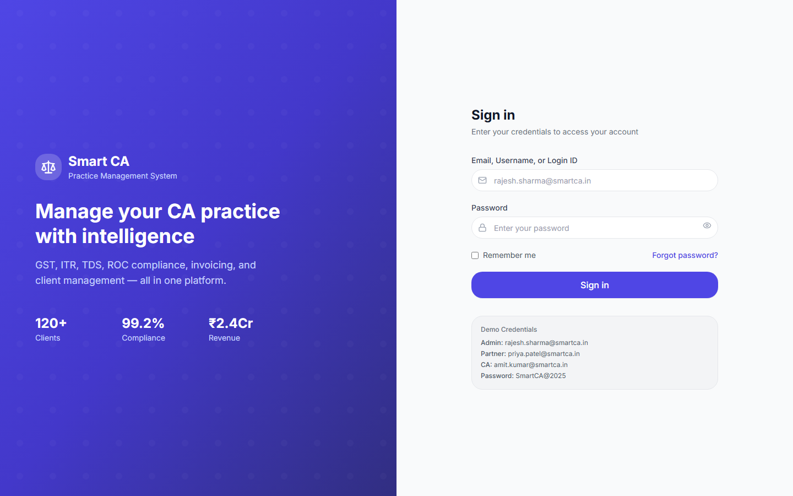 |
| Dashboard | 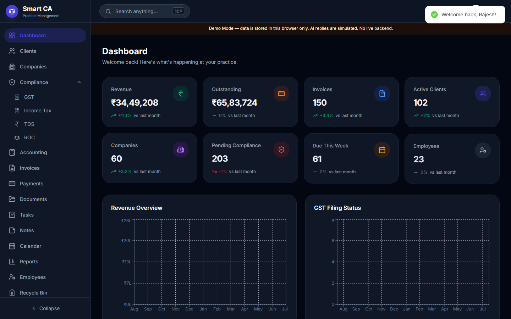 |
| Clients | 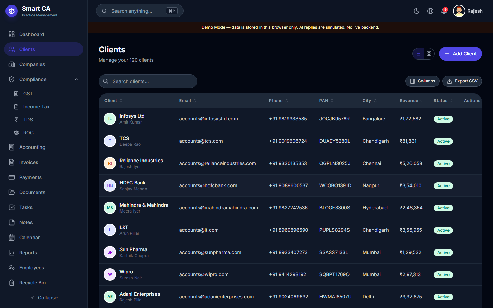 |
| Client details | 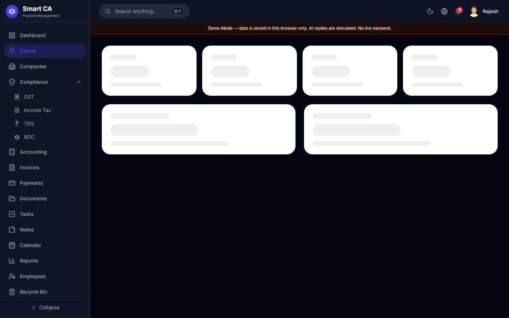 |
| Documents | 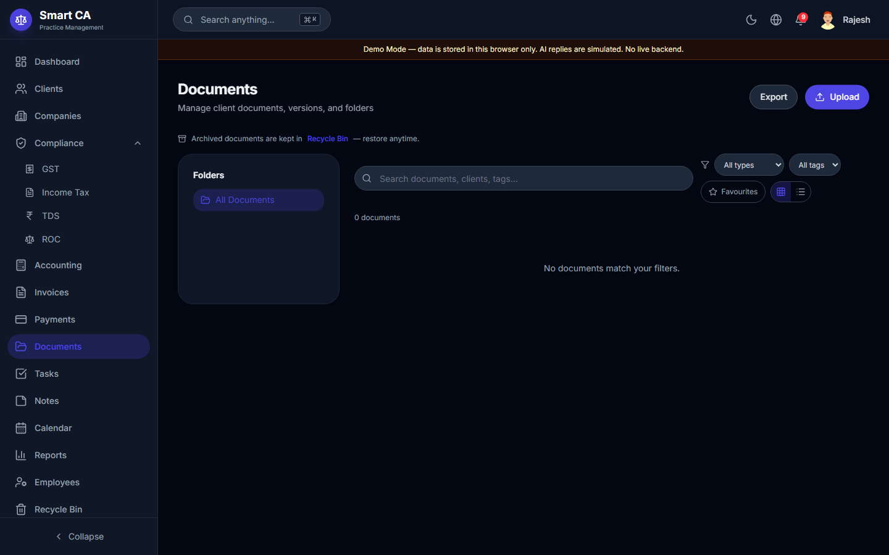 |
| Calendar | 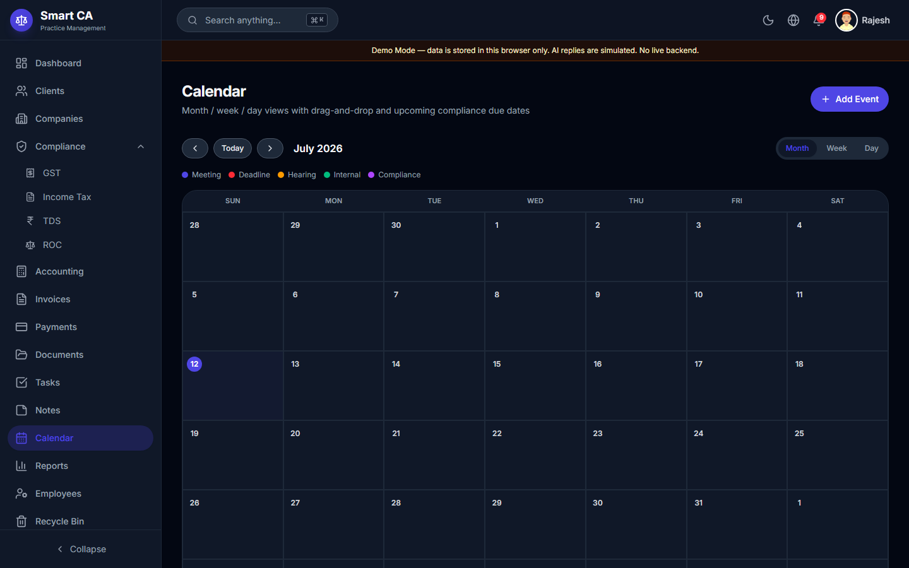 |
| Accounting | 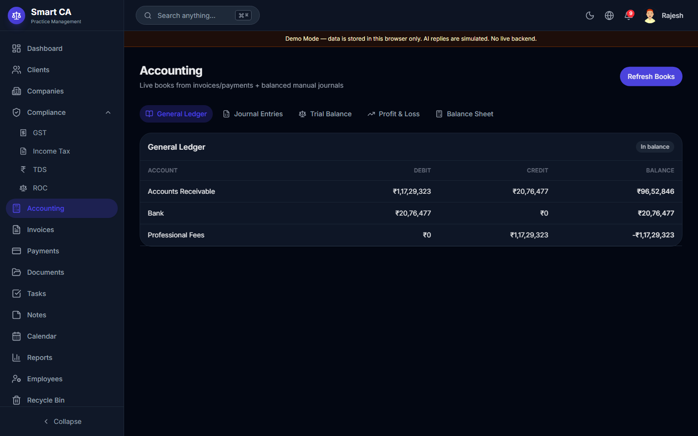 |
| Reports | 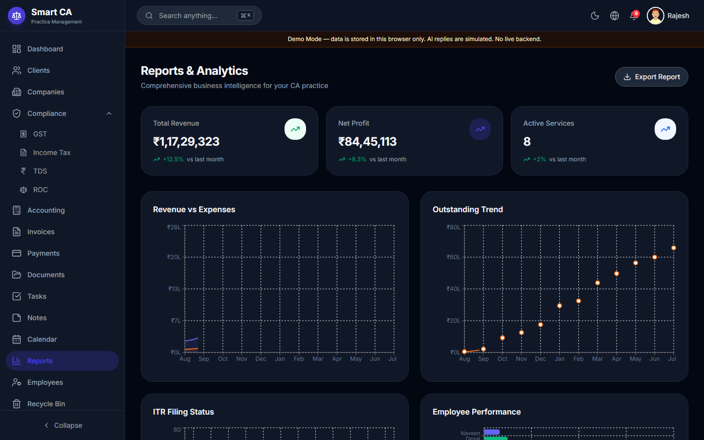 |
| Settings | 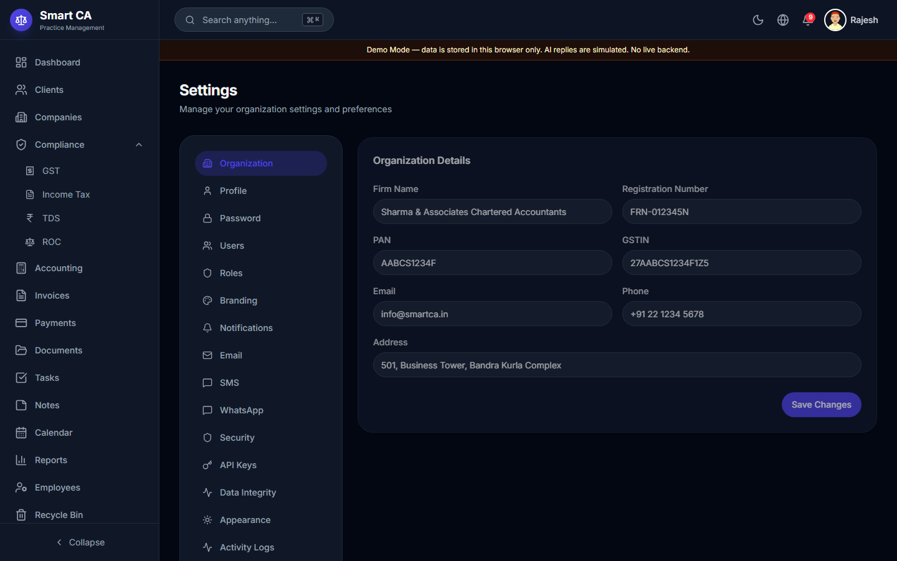 |
| Dark mode | 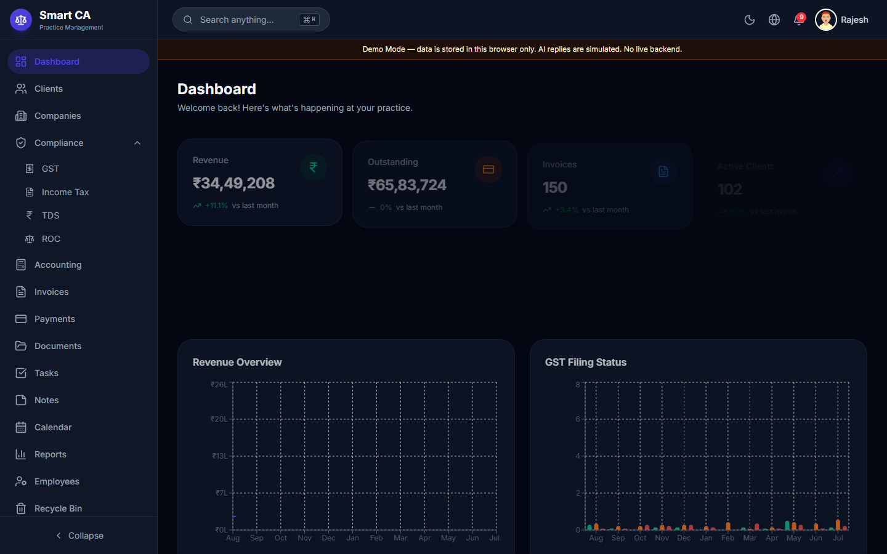 |
| Switch OFF (light) | 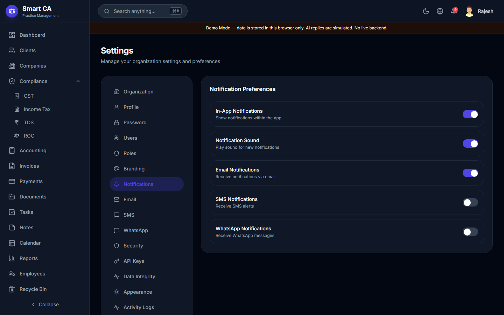 |
| Switch ON (light) | 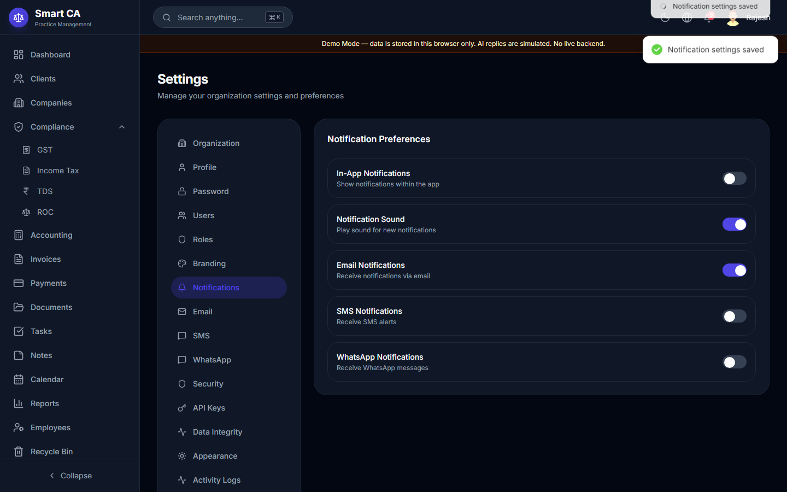 |
| Switch OFF (dark) | 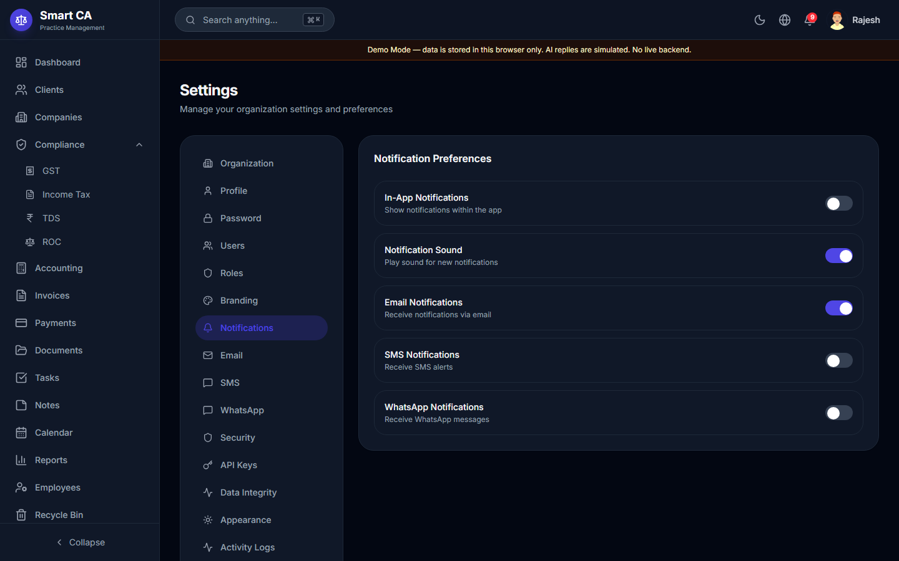 |
| Switch ON (dark) | 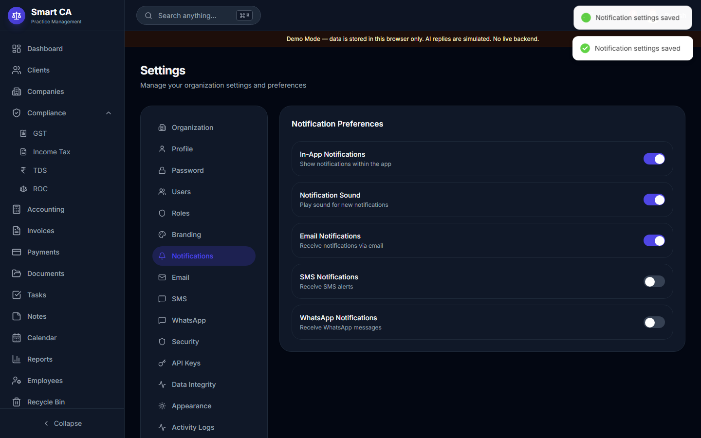 |

Regenerate locally (dev server required):

```bash
npm run qa:screenshots
```

---

## Technology stack

Versions from `package.json` (v1.0.0):

| Area | Package | Version |
|------|---------|---------|
| UI | `react` / `react-dom` | ^19.2.7 |
| Language | `typescript` | ~6.0.2 |
| Bundler | `vite` | ^8.1.1 |
| Styling | `tailwindcss` / `@tailwindcss/vite` | ^4.3.2 |
| Routing | `react-router` | ^7.18.1 |
| State | `zustand` | ^5.0.14 |
| Server state | `@tanstack/react-query` | ^5.101.2 |
| Tables | `@tanstack/react-table` | ^8.21.3 |
| Forms | `react-hook-form` + `@hookform/resolvers` + `zod` | ^7.81.0 / ^5.4.0 / ^4.4.3 |
| Motion | `framer-motion` | ^12.42.2 |
| Charts | `recharts` | ^3.9.2 |
| UI primitives | `@headlessui/react`, `lucide-react` | ^2.2.10 / ^1.23.0 |
| QA | `playwright` / `@playwright/test` | ^1.61.1 |
| API | Go REST (`../Go`) | in-memory demo |
| Persistence | Go seed (restart resets) | not LocalStorage business DB |

---

## Application architecture

```
UI (Pages / Layout)
  → Components (tables, forms, modals)
  → Hooks / Zustand stores (auth, theme, notifications)
  → Services / repositories (HTTP via VITE_API_BASE_URL)
  → Go REST API (/api/v1) → in-memory store + embedded seed
```

See backend docs in [`../Go/README.md`](../Go/README.md) and [docs/ARCHITECTURE.md](docs/ARCHITECTURE.md).

---

## Project structure

```
smart-ca/
├── docs/                  # Architecture, demo guide, QA, limitations, screenshots
├── public/
├── scripts/               # Mock generators, Playwright QA, screenshots
├── src/
│   ├── assets/
│   ├── components/        # common + layout + auth
│   ├── config/
│   ├── constants/         # navigation, status colors
│   ├── db/                # MockDatabase + seed
│   ├── hooks/
│   ├── mock/              # JSON seed data
│   ├── pages/             # route-level feature modules
│   ├── qa/                # Dev QA API expose (window.__SMART_CA_QA__)
│   ├── repositories/
│   ├── routes/
│   ├── schemas/           # Zod entity schemas
│   ├── services/          # domain + analytics + accounting + integrity
│   ├── store/             # Zustand
│   ├── types/
│   └── utils/             # money, transaction, branding, export…
├── package.json
├── vite.config.ts
└── README.md
```

---

## Data and persistence

1. Start the Go backend; it loads the embedded deterministic seed into memory.
2. CRUD goes through frontend services → HTTP → Go handlers/services/store.
3. Browser refresh keeps the session token; **server restart reloads seed** (mutations are not durable).
4. Use `POST /api/v1/demo/reset` (super_admin + `DEMO_RESET_ENABLED`) to reset without restarting when enabled.

---

## Authentication and RBAC

- Login against Go `POST /api/v1/auth/login` (bcrypt `passwordHash` on the API)
- Token in LocalStorage / Zustand (`smart-ca-token` / `smart-ca-auth`); API holds opaque sessions
- Remember Me + idle **session timeout** (minutes from Settings → Security)
- `ProtectedRoute` / guest routes
- Roles / permissions from API; nav filtered by permission
- Settings → Roles permission matrix; Users CRUD (demo)

### Demo credentials

| Role hint | Identifier | Password |
|-----------|------------|----------|
| Admin (example) | `rajesh.sharma@smartca.in` | `SmartCA@2025` |

**Warning:** Demo-only credentials. Never reuse them in production. Never commit real secrets.

---

## CRUD and relational behaviour

Supported patterns across modules: create, read, update, delete, duplicate (where implemented), archive, restore (Recycle Bin), search, sort, filter, pagination, CSV export (via API-backed data; not LocalStorage business DB).

**Verified financial relationship:**

```
Payment (completed)
  → invoice.paidAmount = Σ payments
  → invoice.status = sent | partially_paid | paid | overdue
  → invoice.remainingAmount = total − paidAmount
  → client.outstanding / revenue recalculated
  → dashboard / reports recompute from invoices
```

Default invoice tax: `total = subtotal + round(subtotal × 0.18)` (CGST/SGST split), unless an explicit tax breakdown is supplied.

---

## Module overview

| Module | Main capabilities | Demo status |
|--------|-------------------|-------------|
| Dashboard | Live KPIs, clickable widgets | Working |
| Clients / Detail | CRUD, archive, tabs, prefill deep links | Working |
| Companies | CRUD, archive | Working |
| Employees | CRUD, archive, task reassign on delete | Working |
| Invoices | CRUD, tax, duplicate, archive | Working |
| Payments | CRUD, validation, sync | Working |
| Documents | Metadata DMS simulation | Simulated files |
| Compliance / GST / ITR / TDS / ROC | Tables / kanban CRUD | Working (shared filing forms) |
| Accounting | Live books + manual journals | Demo ledgers |
| Calendar | Month/Week/Day, DnD | Working |
| Reports | Live charts/exports | Working |
| Tasks / Notes | CRUD | Working |
| Recycle Bin | Restore / purge | Working |
| AI Assistant | Chat UI | Simulated replies |
| Settings | Org, users, roles, branding, integrity | Working |
| Auth | Login / logout / forgot stub | API-backed (demo) |

---

## Local development

### Prerequisites

- Node.js 20+ recommended
- npm
- Go 1.22+ (for `../Go`; developed with go1.26.5)

### Clone & install

```bash
git clone https://github.com/JagtapAvadhut/SmartCA.git
cd SmartCA/saas
npm install
cp .env.example .env   # VITE_API_BASE_URL=http://localhost:8080/api/v1
```

Start the Go API from `../Go` before (or alongside) the UI — see **Run both** above.

### Run

```bash
npm run dev
```

Open the URL Vite prints (typically `http://localhost:5173/`). The Go API must be listening on port 8080.

### Build & preview

```bash
npm run build
npm run preview
```

### QA scripts (dev server should be running for browser suites)

```bash
npm run qa:browser      # Playwright UI / regression suite
npm run qa:business     # Exact business-logic assertions
npm run qa:screenshots  # Refresh docs/screenshots
```

---

## QA and verification

Latest verified runs (see [docs/QA_REPORT.md](docs/QA_REPORT.md)):

| Suite | Command | Result |
|-------|---------|--------|
| Browser regression | `npm run qa:browser` | **112 PASS / 0 FAIL** |
| Business logic | `npm run qa:business` | **24 PASS / 0 FAIL** |
| Production build | `npm run build` | **PASS** (`tsc -b` + Vite) |

Coverage highlights: page loads, dark mode, viewports, CRUD flows, Client→Invoice→Payment exact outstanding deltas, payment validation, accounting balance invariants, integrity repair, **Switch geometry / keyboard / persistence** (Settings notifications & security).

Notable fixes during QA: form reset wiping inputs; `partially_paid` status; payment overpay rejection; orphan payment cleanup; live accounting engine; Data Integrity settings; **switch thumb overflow** (absolute thumb without fixed inset + async controlled state).

---

## Responsive design

Playwright overflow checks were run at viewports including **320, 375, 390, 414, 768, 1024, 1280, 1440, 1920**. Tables and settings use horizontal scroll containers where needed.

---

## Dark mode, theming, and shared controls

- Theme: light / dark / system via Zustand (`smart-ca-theme`), available from the topbar and Settings → Appearance
- Branding: Settings → Branding applies primary color via injected CSS variables (`applyBrandingFromSettings`)
- Language preference is stored for future i18n (UI strings remain English in v1.0)
- **Switch / toggle:** one shared `Switch` + `SwitchField` (`src/components/common/Switch.tsx`) built on Headless UI
  - Track 44×24, thumb 20×20, padding 2px → travel **20px** (`translate-x-5` from `left-0.5`)
  - Thumb stays inside the track in OFF and ON (verified in Playwright geometry assertions)
  - Keyboard Space/Enter, focus-visible ring, disabled state, Light/Dark, `motion-reduce`
  - Settings notification/security toggles use optimistic LocalStorage updates so the thumb does not snap back while `simulateDelay` runs
- Status badges use paired Light/Dark semantic tokens (`src/constants/status.ts`)
- Demo Mode banner remains visible in the authenticated shell

---

## Recommended demo workflow

See the full script in [docs/DEMO_GUIDE.md](docs/DEMO_GUIDE.md).

Short path:

1. Start Go API (`../Go`) then login with demo admin
2. Dashboard KPIs
3. Create Client → Invoice → Payment
4. Confirm outstanding / invoice status (restarting Go resets seed)
5. Documents → Recycle Bin restore
6. Calendar + Accounting
7. Settings branding / users / roles / Data Integrity
8. Dark mode + Ctrl/Cmd+K search

---

## Current limitations

See [docs/KNOWN_LIMITATIONS.md](docs/KNOWN_LIMITATIONS.md) and [`../Go/README.md`](../Go/README.md).

Highlights: Go API is **in-memory only** (restart resets seed); demo credentials; no real object storage; no real AI; no email/SMS/WhatsApp delivery; no government portal filing; accounting is practice-demo oriented. **Not** production-ready for real customer data.

---

## Roadmap (realistic)

1. Durable database (e.g. PostgreSQL) behind the existing Go API
2. Hardened auth (HTTPS, hardened session/JWT policy, secret management)
3. Multi-tenant firm isolation
4. Object storage for documents
5. Server-side audit logging
6. Real GST/ITR/email integrations as products mature
7. Real AI with retrieval controls
8. Playwright in CI, deployment, observability

---

## Contributing

1. Fork / branch from `main`
2. Start `../Go` API; `npm install` && `npm run dev` in `saas`
3. Prefer small PRs; keep demo disclaimers accurate
4. Run `npm run build` and relevant `npm run qa:*` before opening a PR
5. Do not commit `.env`, secrets, `node_modules`, or `dist`

---

## License

No `LICENSE` file is included in this repository yet. All rights reserved by the repository owner unless a license is added later.

---

## Project status

| | |
|---|---|
| **Version** | 1.0.0 Demo Release |
| **Demo-ready frontend** | Yes |
| **Production-ready for real customer data** | **No** |
