# Smart CA

**Practice management for Chartered Accountant firms** — clients, companies, GST/ITR/TDS/ROC compliance, invoicing, payments, documents, accounting, reports, and an AI assistant, in one platform.

React (Vite) frontend + Go REST API + PostgreSQL, with optional Google Gemini AI (server-side only).

[](./LICENSE)
[](./Go/go.mod)
[](./saas/package.json)
[](./docs/database/DATABASE_SETUP.md)
[](./docker-compose.yml)

---

## Quick start (Docker only)

**Requirement:** [Docker Desktop](https://www.docker.com/products/docker-desktop/) (Windows/macOS) or Docker Engine + Compose v2 (Linux).

You do **not** need Go, Node.js, npm, or PostgreSQL installed on the host.

```bash
git clone https://github.com/JagtapAvadhut/SmartCA.git
cd SmartCA
docker compose up --build -d
```

Open **http://localhost:8080**

| Role | Email | Password |
|------|-------|----------|
| Super Admin | `rajesh.sharma@smartca.in` | `SmartCA@2025` |

That is the complete local setup. Compose starts PostgreSQL, runs migrations, seeds demo data, starts the Go API (`AI_PROVIDER=mock` by default), and serves the React app through nginx. **No `.env` file is required.**

| URL | Purpose |
|-----|---------|
| http://localhost:8080 | Application |
| http://localhost:8080/docs | Swagger UI (OpenAPI) |
| http://localhost:8080/openapi.yaml | OpenAPI spec |
| http://localhost:8080/health | Web liveness |
| http://localhost:8080/health/live | API liveness |
| http://localhost:8080/health/ready | API readiness (DB) |

```bash
docker compose ps          # db, api, web should be healthy
docker compose logs -f
docker compose down        # stop (keeps database volume)
docker compose down -v     # wipe DB (re-seeds on next up)
```

Optional live Gemini (no code changes):

```bash
cp .env.example .env
# set AI_PROVIDER=gemini and GEMINI_API_KEY=...
docker compose up -d --force-recreate api
```

---

## Table of Contents

- [Quick start (Docker only)](#quick-start-docker-only)
- [Overview](#overview)
- [Architecture](#architecture)
- [Features](#features)
- [Technology Stack](#technology-stack)
- [Folder Structure](#folder-structure)
- [Screenshots](#screenshots)
- [Native development (optional)](#native-development-optional)
- [Environment Variables](#environment-variables)
- [Database](#database)
- [Authentication](#authentication)
- [Gemini AI](#gemini-ai)
- [RBAC](#rbac)
- [Modules](#modules)
- [Roadmap](#roadmap)
- [Contributing](#contributing)
- [License](#license)

---

## Overview

Smart CA helps a CA firm run its practice end-to-end: client and company records, statutory compliance (GST, Income Tax/ITR, TDS, ROC), invoicing and payment collection, document management, tasks/notes/calendar, double-entry style accounting reports, role-based user administration, and an AI assistant grounded in the firm's own data.

Business data is owned by the **Go API** and persisted in **PostgreSQL**. The React app never talks to the database or to Gemini directly — every request goes through the Go REST API.

**Docker is the supported way to run Smart CA.** Native Go/Node installs are optional for contributors who want hot reload.

## Architecture

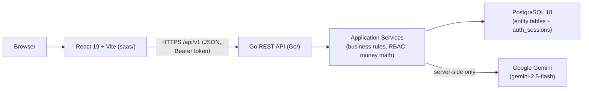

**Docker Compose topology** (`docker compose up --build`):

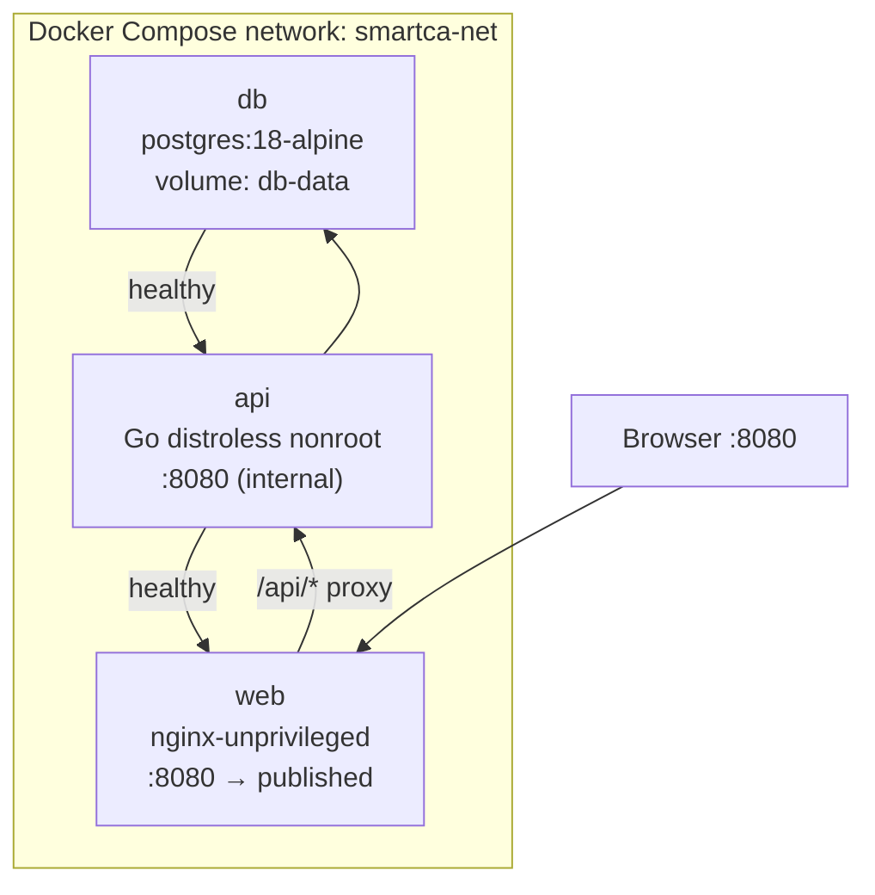

### Request flow

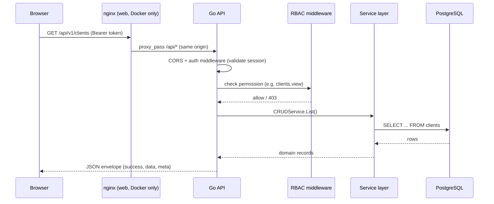

In native development the browser talks to the Go API directly on `:8080` (no nginx hop); in Docker, nginx serves the SPA and reverse-proxies `/api/*` to the `api` service.

## Features

| Module | Capability |
|--------|------------|
| Auth & RBAC | Opaque Bearer sessions (PostgreSQL-backed), permission-gated routes & UI actions |
| Dashboard / Reports | Live KPIs, revenue/outstanding trends, GST filing status, compliance due |
| Clients / Companies / Employees | Full CRUD, archive & restore (Recycle Bin) |
| Invoices / Payments | Server-side totals, GST money math (paise-accurate), payment reconciliation |
| Documents | Folder-based metadata CRUD, search, favourites |
| Tasks / Notes / Calendar | Day-to-day practice operations |
| Compliance | GST, ITR, TDS, ROC filing trackers with due dates and status |
| Accounting | Journals, revenue/expense trend, profit & loss inputs |
| Settings / Users / Roles | Organization profile, branding, notification channels, RBAC administration |
| AI Assistant | Chat, summarization, email drafting, insights — `AI_PROVIDER=mock` by default (offline); optional Gemini via env |
| Search / Recycle Bin / Notifications | Cross-cutting UX shared by every module |
| Theming | Light / Dark / System, responsive layout (desktop, tablet, mobile) |

## Technology Stack

### Frontend (`saas/`)

| Technology | Version |
|------------|---------|
| React / React DOM | ^19.2.7 |
| Vite | ^8.1.1 |
| TypeScript | ~6.0.2 |
| Tailwind CSS | ^4.3.2 |
| TanStack Query / Table | ^5.101.2 / ^8.21.3 |
| Zustand | ^5.0.14 |
| react-router | ^7.18.1 |
| react-hook-form + zod | ^7.81.0 / ^4.4.3 |
| recharts, framer-motion, lucide-react | as declared in `package.json` |
| Playwright | ^1.61.1 (QA + screenshot capture) |
| Package manager | npm (`package-lock.json`) |

### Backend (`Go/`)

| Technology | Version |
|------------|---------|
| Go | 1.26.5 |
| chi router | v5.3.1 |
| lib/pq (PostgreSQL driver) | v1.10.9 |
| google/uuid | v1.6.0 |
| golang.org/x/crypto (bcrypt) | v0.54.0 |

### Data & AI

| Component | Details |
|-----------|---------|
| Database | PostgreSQL 14+ (developed/tested on 18), SQL migrations in `Go/migrations/` |
| AI provider | Google Gemini (`gemini-2.5-flash` default) via a server-side provider abstraction; falls back to a deterministic `mock` provider with no API key |

## Folder Structure

```
SmartCA/
├── README.md                 # This file
├── LICENSE
├── CHANGELOG.md
├── docker-compose.yml        # db + api + web orchestration
├── .env.example               # Compose variable overrides (no secrets)
├── Go/                        # Backend — Go REST API
│   ├── cmd/api/                # Entrypoint (+ -healthcheck flag)
│   ├── internal/                # handlers, services, repository, auth, RBAC, AI
│   ├── migrations/               # Versioned SQL migrations
│   ├── scripts/                  # Database setup helpers
│   ├── pkg/apiresponse/           # JSON response envelopes
│   ├── Dockerfile
│   ├── .dockerignore
│   ├── .env.example
│   ├── QUICKSTART.md
│   └── README.md
├── saas/                       # Frontend — React + Vite
│   ├── src/                      # pages, components, services, store
│   ├── scripts/                    # Playwright QA + screenshot capture
│   ├── public/
│   ├── Dockerfile
│   ├── nginx.conf                  # SPA + /api reverse proxy (Docker)
│   ├── .dockerignore
│   ├── .env.example
│   └── README.md
└── docs/
    ├── screenshots/                # README screenshots (real, fully loaded)
    ├── architecture/                 # Diagrams reference
    ├── api/openapi.yaml               # Partial OpenAPI spec
    ├── database/                       # Setup guide + migration history
    └── reports/                         # Historical GA/RC release reports
```

## Screenshots

All screenshots below are real captures of the running application (Go API + PostgreSQL + React), taken with Playwright at `1440×900` unless noted — no skeletons, no loading spinners, no mock/demo banners.

| | |
|---|---|
| **Login** |  |
| **Dashboard** |  |
| **Clients** |  |
| **Companies** | 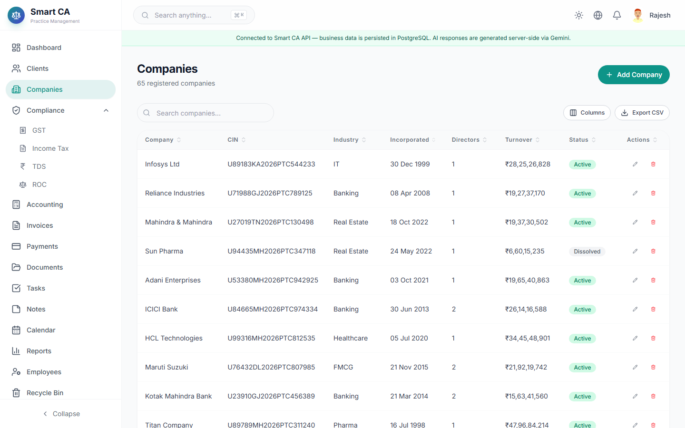 |
| **Invoices** | 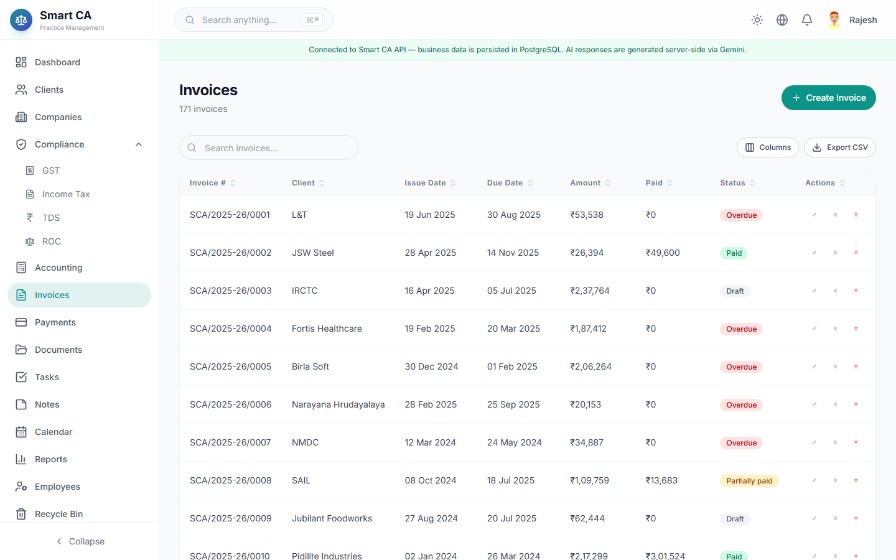 |
| **Payments** | 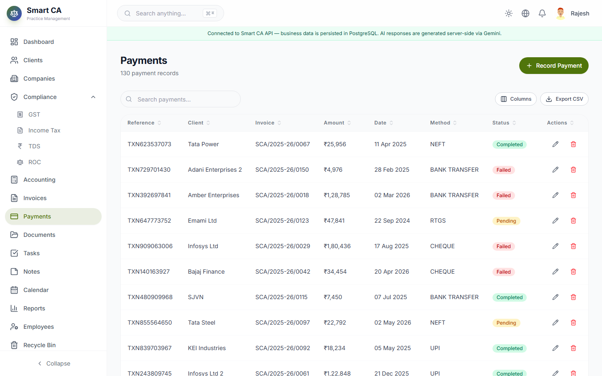 |
| **Compliance** | 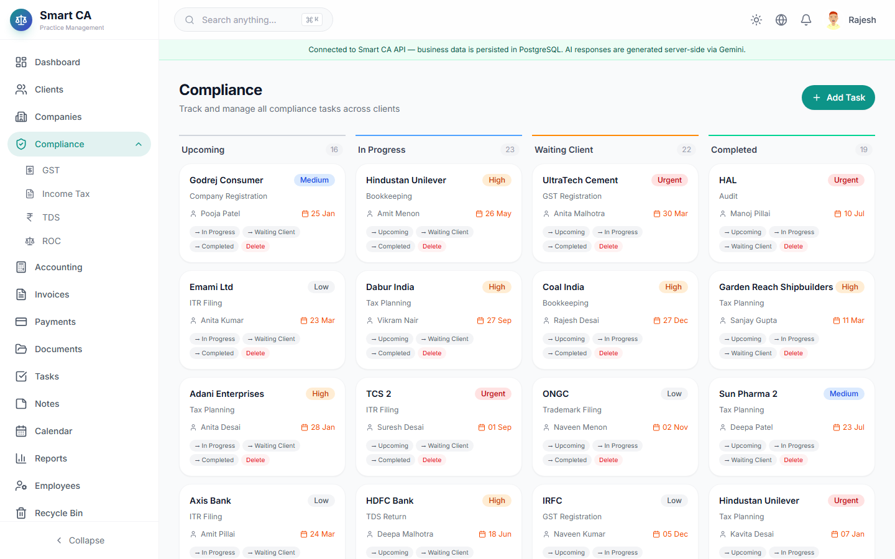 |
| **GST** | 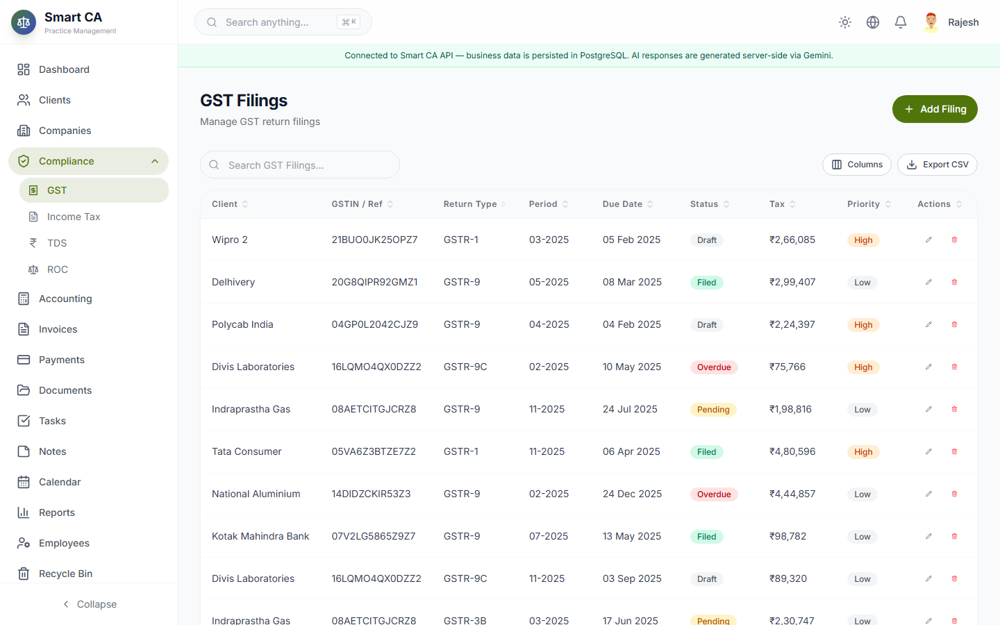 |
| **ITR** | 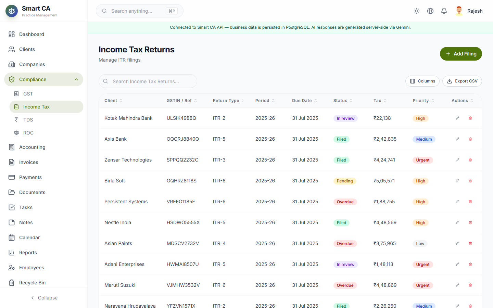 |
| **TDS** | 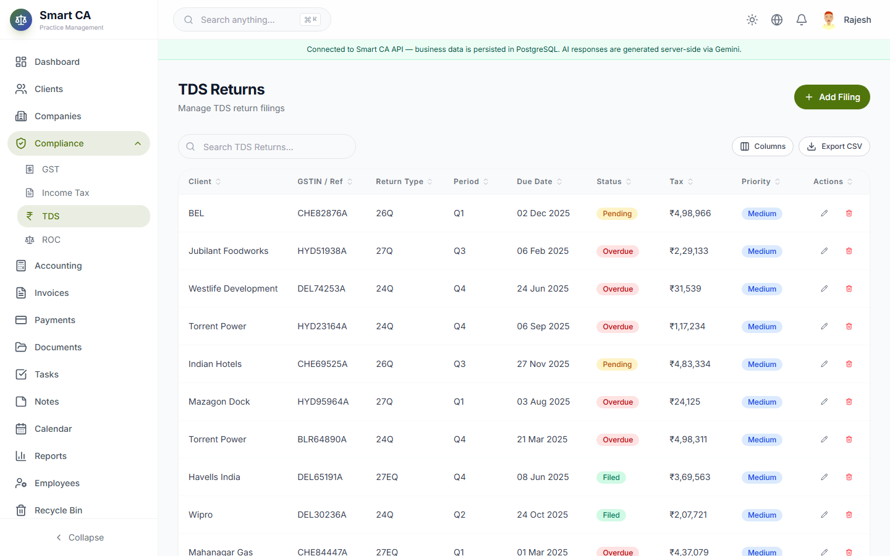 |
| **ROC** | 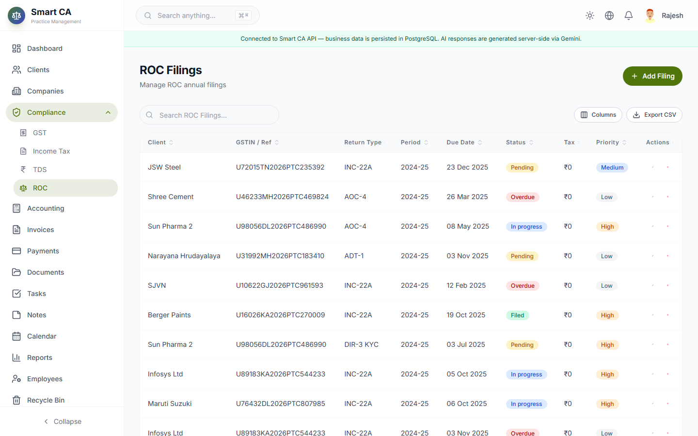 |
| **Reports** |  |
| **Documents** |  |
| **AI Assistant** | 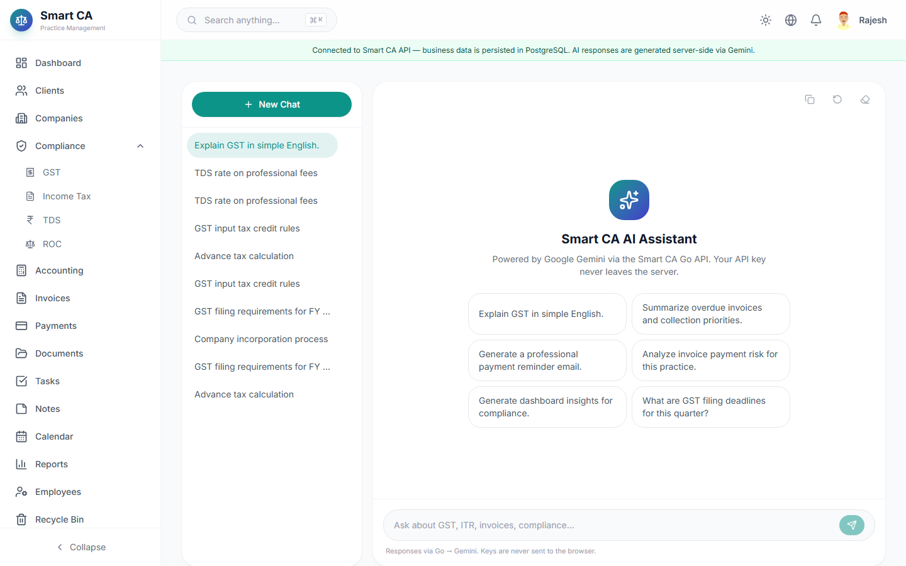 |
| **Settings** |  |
| **Dark Mode** |  |
| **Light Mode** |  |
| **Responsive — Tablet** | 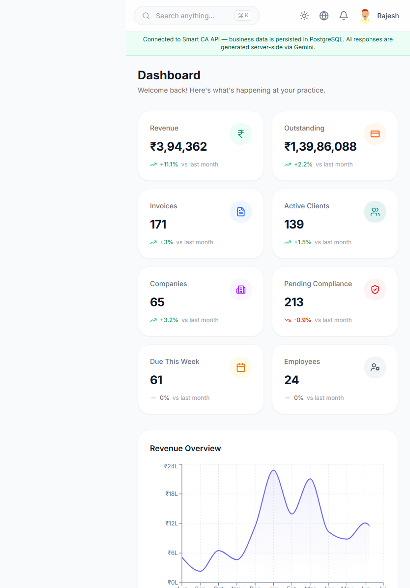 |
| **Responsive — Mobile** | 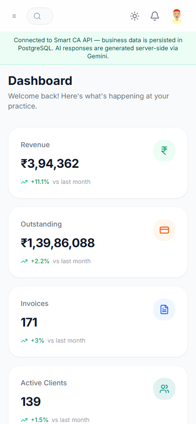 |

Regenerate them anytime (native dev servers must be running — see [Native development (optional)](#native-development-optional)):

```bash
cd saas
node scripts/capture-screenshots.mjs
```

## Native development (optional)

Only needed if you want Vite HMR or `go run` without Docker. **Not required to use Smart CA.**

Prerequisites: Go 1.24+, Node.js 22.x + npm, PostgreSQL 14+.

```bash
# Backend
cd Go
cp .env.example .env   # AI_PROVIDER=mock by default
go run ./cmd/api       # migrations + seed on empty DB

# Frontend (new terminal)
cd saas
cp .env.example .env
npm ci
npm run dev            # http://localhost:5173
```

### Additional demo accounts

| Role | Email | Password |
|------|-------|----------|
| Super Admin | `rajesh.sharma@smartca.in` | `SmartCA@2025` |
| Admin | `priya.patel@smartca.in` | `SmartCA@2025` |
| Partner | `amit.kumar@smartca.in` | `SmartCA@2025` |
| CA | `vikram.iyer@smartca.in` | `SmartCA@2025` |

### Tests & QA (maintainers)

With Docker already running (`docker compose up --build -d`):

```bash
cd saas && npm ci && npm run qa:auth && npm run qa:business && npm run qa:browser
cd ../Go && gofmt -l . && go vet ./... && go test ./... && go build ./cmd/api
```

### Docker stack details

| Service | Image base | Published port | Notes |
|---------|------------|----------------|-------|
| `db` | `postgres:18-alpine` | internal | Volume `db-data`; `pg_isready` healthcheck |
| `api` | distroless nonroot | internal | Waits for db; migrations + seed; OpenAPI at `/docs` |
| `web` | nginx-unprivileged | **8080** | Waits for api; SPA + `/api/*` + `/docs` proxy |

Design: multi-stage builds, non-root, `cap_drop: ALL`, `depends_on: service_healthy` (`db → api → web`), mock AI by default.

---

## Environment Variables

**Docker users:** no `.env` file is required. Optional overrides via root `.env` (from `.env.example`). **Never commit a real `.env`.**

### Root (`/.env.example`) — Docker Compose overrides

| Variable | Default | Purpose |
|----------|---------|---------|
| `DB_USER` / `DB_PASSWORD` / `DB_NAME` | `smartca` / `smartca` / `smartca` | PostgreSQL credentials shared by `db` + `api` |
| `AI_PROVIDER` | `mock` | `gemini` \| `mock` |
| `GEMINI_API_KEY` | _(empty)_ | Required only when `AI_PROVIDER=gemini` |
| `GEMINI_MODEL` | `gemini-2.5-flash` | Gemini model id |

### Backend (`Go/.env.example`) — native only

See file for `APP_ENV`, `HTTP_*`, `FRONTEND_ORIGIN`, `SESSION_TTL`, `DEMO_RESET_ENABLED`, `DB_*`, and `AI_*`. Default `AI_PROVIDER=mock`.

### Frontend (`saas/.env.example`) — build-time `VITE_*`

| Variable | Native | Docker image build |
|----------|--------|---------------------|
| `VITE_API_BASE_URL` | `http://localhost:8080/api/v1` | `/api/v1` (same-origin; nginx proxies to `api`) |
| `VITE_APP_NAME` | `Smart CA` | `Smart CA` |

Never put secrets in a `VITE_*` variable.

## Database

- PostgreSQL 18 in Docker (14+ for native); SQL migrations in [`Go/migrations/`](Go/migrations)
- **Automatic on API boot:** connect (with retry), run migrations, seed demo data when empty
- No manual SQL required for Docker users
- Seed data is embedded JSON (`Go/internal/seed/data/*.json`, `go:embed`)
- Guides: [`docs/database/DATABASE_SETUP.md`](docs/database/DATABASE_SETUP.md) · [`docs/database/MIGRATION_GUIDE.md`](docs/database/MIGRATION_GUIDE.md)

## Authentication

| Item | Behavior |
|------|----------|
| Login | `POST /api/v1/auth/login` `{ identifier, password, rememberMe?, device? }` |
| Identifier | Email, username, **or** login ID |
| Session | Opaque Bearer token, persisted in the `auth_sessions` table |
| Storage (browser) | `localStorage` key `smart-ca-token` (token only — not a business database) |
| Me / Logout | `GET /api/v1/auth/me`, `POST /api/v1/auth/logout` |
| Password hashing | bcrypt (`golang.org/x/crypto`) |
| CORS | Explicit `FRONTEND_ORIGIN` allowlist (`localhost` ≠ `127.0.0.1`; `*` is rejected) |

## Gemini AI

- Default: **`AI_PROVIDER=mock`** (offline, no key) in Docker and native config
- Set `AI_PROVIDER=gemini` + `GEMINI_API_KEY` in root `.env` for live Gemini — no code changes
- All Gemini calls happen **inside the Go API** — the key never reaches the browser
- Endpoints under `/api/v1/ai/*`: chat, summarization, email drafting, dashboard insights
- Get a key: <https://aistudio.google.com/apikey>
## RBAC

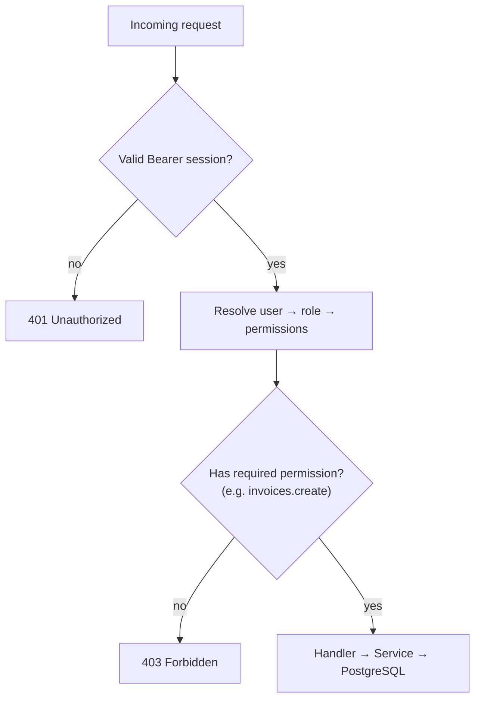

- Permissions are granular per module and action, e.g. `clients.view`, `invoices.create`, `settings.roles` (see `Go/internal/rbac/rbac.go`)
- Roles bundle permissions (`roles` + `role_permissions` tables); users can also get direct permission overrides
- The React UI reads the same permission set to hide/disable actions — enforcement is always re-checked server-side

## Modules

Clients · Companies · Employees · Compliance (GST, ITR, TDS, ROC) · Accounting · Invoices · Payments · Documents · Tasks · Notes · Calendar · Reports · Recycle Bin · Search · Notifications · Settings (Organization, Users, Roles, Branding, Notifications, Security, API Keys, Data Integrity, Appearance, Activity Logs) · AI Assistant

## Roadmap

- [ ] Binary document storage (S3-compatible object storage) — currently metadata-only
- [ ] Real-time notifications (WebSocket/SSE) instead of polling
- [ ] Multi-tenant firm isolation
- [ ] Audit-grade accounting exports (Tally/Excel reconciliation)
- [ ] Additional AI providers (OpenAI, Claude, Azure, Ollama) behind the existing provider interface
- [ ] CI pipeline (lint, test, build, image scan) on GitHub Actions

## Contributing

Contributions are welcome.

1. Fork the repository and create a feature branch
2. Follow existing code style (`gofmt`, `go vet` for Go; `oxlint`, `tsc -b` for TypeScript)
3. Add/update tests where practical
4. Open a pull request describing the change and how you tested it

Please avoid committing `.env` files, build artifacts, or generated reports — see `.gitignore` for what's already excluded.

## License

[MIT](./LICENSE) © Avadhut Jagtap

---

Additional documentation: [Architecture](docs/architecture/ARCHITECTURE.md) · [Database](docs/database/DATABASE_SETUP.md) · [OpenAPI](docs/api/openapi.yaml) · [Backend README](Go/README.md) · [Frontend README](saas/README.md) · [Changelog](CHANGELOG.md) · [Docker local setup report](DOCKER_LOCAL_SETUP_REPORT.md) · [Historical release reports](docs/reports)
