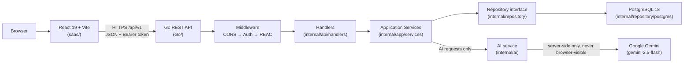
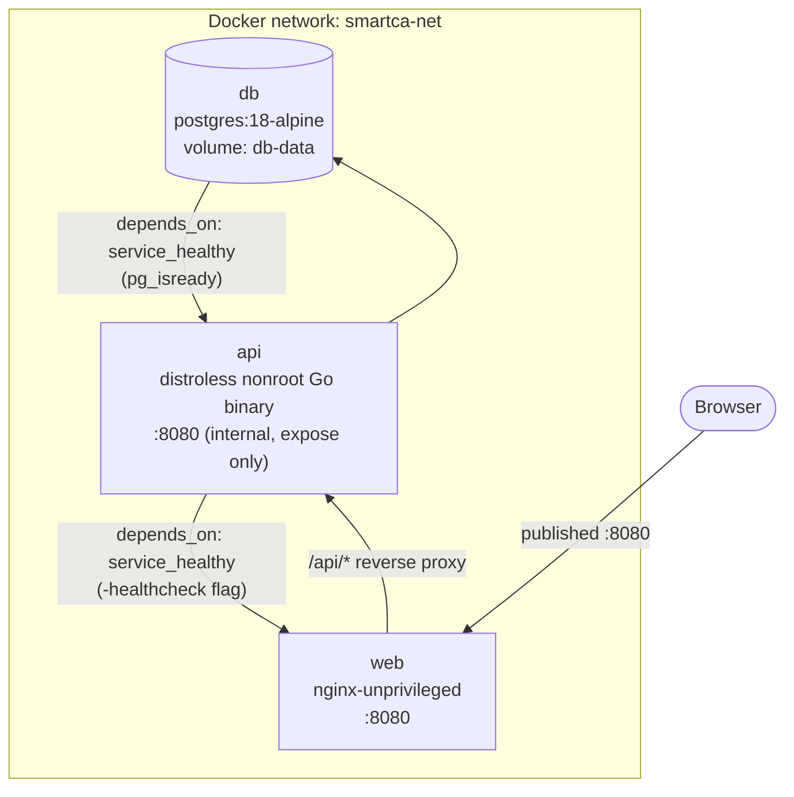
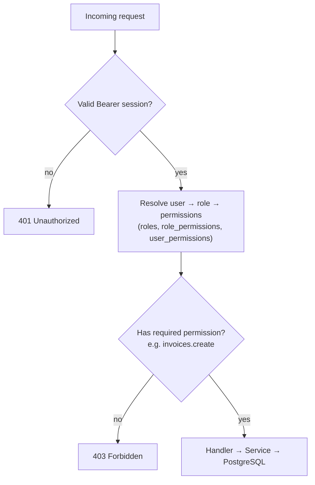
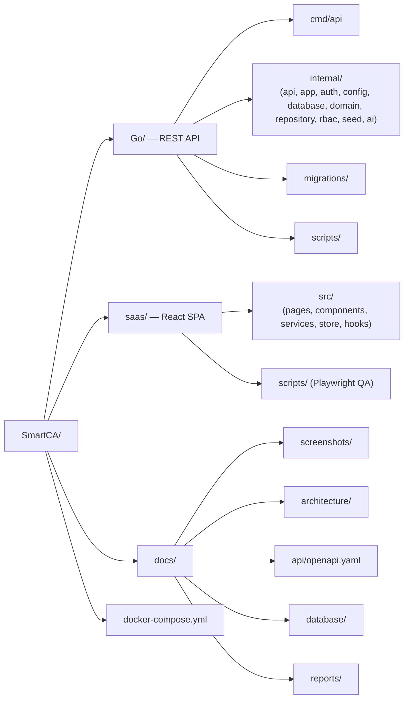

# Architecture

Canonical reference for how Smart CA is put together. The same diagrams are summarized in the root [README](../../README.md); this document goes one level deeper.

## System overview



Key rule: the React app **never** talks to PostgreSQL or Gemini directly. Every read/write and every AI call is mediated by the Go API, which enforces authentication, RBAC, and money-math correctness.

## Docker Compose topology



`docker compose up --build` brings the three services up in that order automatically via `depends_on: condition: service_healthy`.

## Request flow (authenticated read)

```mermaid
sequenceDiagram
  participant Browser
  participant Nginx as nginx (Docker only)
  participant API as Go API
  participant MW as Auth/RBAC middleware
  participant Svc as Service layer
  participant DB as PostgreSQL

  Browser->>Nginx: GET /api/v1/clients (Authorization: Bearer ...)
  Nginx->>API: proxy_pass (same-origin in Docker; direct in native dev)
  API->>MW: validate session token
  MW->>MW: resolve user → role → permissions
  MW-->>API: allow (clients.view) or 401/403
  API->>Svc: CRUDService.List(ColClients)
  Svc->>DB: SELECT ... FROM clients WHERE ...
  DB-->>Svc: rows
  Svc-->>API: []models.Record
  API-->>Browser: {"success":true,"data":[...],"meta":{"requestId":"..."}}
```

## RBAC model



Permissions are granular per module + action (`clients.view`, `invoices.create`, `settings.roles`, …) defined in `Go/internal/rbac/rbac.go`. Roles bundle permissions; users may also receive direct permission overrides. The React UI reads the same permission set to hide/disable actions, but every mutation is re-validated server-side — the frontend is never the source of authorization truth.

## Folder structure



## Related documents

- [Database setup](../database/DATABASE_SETUP.md) and [migration history](../database/MIGRATION_GUIDE.md)
- [OpenAPI reference](../api/openapi.yaml)
- [Historical release reports](../reports)
