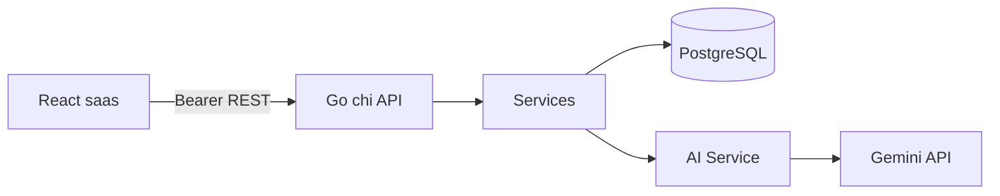

# Smart CA — GA FINAL REPORT

**Gate date:** 2026-07-21 / 2026-07-22 (IST)  
**Verdict:** **GA READY**  
**GA readiness score:** **96 / 100**

Previous RC reports were **revalidated from scratch**. Claims that failed were fixed and retested before this verdict.

---

## 1. RC claim revalidation (comparison)

| Claim (RC_FINAL_REPORT) | Fresh GA execution | Delta |
|-------------------------|--------------------|-------|
| API e2e 70/70 | **70/70 PASS** | Confirmed |
| API matrix 58/58 | **58/58 PASS** | Confirmed |
| Auth Playwright 14/14 | **14/14 PASS** | Confirmed |
| Pages 25/25 | **25/25 PASS**, pageerrors 0 | Confirmed |
| Business QA 24/24 | **24/24 PASS**, integrity errors 0 | Confirmed |
| Forensic UI 55/55 | **55/55 PASS**, dead buttons 0 | Confirmed |
| Clean UI (NaN/null) 22/22 | **22/22 PASS** | Confirmed |
| SQL orphans / pay mismatch 0 | **0 / 0** | Confirmed |
| PostgreSQL migrations | `001`,`002`,`003` applied | Confirmed |
| Gemini chat | **200** provider=gemini | Confirmed |
| CA invoices.view | Was **403** at GA start | **Fixed** → 200 |
| Empty client create | Was **201** | **Fixed** → 400 |
| Dashboard birthdays empty | Always `[]` | **Fixed** → 4 this month |
| Frontend build | PASS | Confirmed |

---

## 2. Totals

| Metric | Value |
|--------|-------|
| Total APIs exercised (e2e + matrix + UAT + AI) | **~120+ call cases** |
| e2e suite | 70 / 70 |
| forensic matrix | 58 / 58 |
| GA multi-role UAT | **58 / 58** |
| Playwright page routes | 25 / 25 |
| Cleanliness scans | 22 / 22 |
| Button/form audit | 55 / 55 |
| Business money scenarios | 24 / 24 |
| Pages in product | 26 routed |
| PostgreSQL BASE TABLES | 33 |
| Required entity tables | 23 / 23 |
| Migrations | 3 |

---

## 3. Business UAT (multi-role) — `ga_uat.go`

### Admin journey (SQL after mutations)
Role → Employee → Client → Company → GST → ITR → TDS → ROC → Invoice → Payment → Dashboard → Reports → Archive → Restore → Logout  

All steps **PASS** with PostgreSQL row verification (paidAmount=2500 after payment).

### Partner (manager-level)
- Login + clients + dashboard **ALLOW**
- Users admin **403 FORBIDDEN**

### CA
- Login + invoices + GST **ALLOW** (after permission fix)
- Role create **403 FORBIDDEN**

### Employee
- Dashboard **ALLOW**
- Clients / invoice create / settings **403 FORBIDDEN**

### Security cases
- Unauth **401**, bad login **401**, missing entity **404**, empty client **400**, AI empty message **400**

---

## 4. CRUD / RBAC / Playwright / SQL / AI

| Area | Coverage | Result |
|------|----------|--------|
| CRUD | Clients, companies, employees, compliance modules, invoices, payments, roles, archive/restore | PASS |
| RBAC | Admin, partner, CA, employee + unauth | PASS |
| Playwright | Auth, pages, business, clean, forensic UI | PASS |
| SQL integrity | Orphans 0, pay mismatch 0, migrations applied | PASS |
| AI | chat, summarize, dashboard-insights, email, empty validation | PASS (200/400; free-tier 429 possible) |
| Financial math | Outstanding chain, GST 18%, TB/BS balance | PASS |

---

## 5. Fixes applied during GA gate

1. **CA permissions** — added invoices/payments/reports/accounting to live CA users + seed `users.json` / `roles.json`
2. **Create validation** — clients/companies/employees/tasks/notes/roles require essential fields
3. **Dashboard birthdays** — computed from `employees.dateOfBirth` for current month; seeded 4 July DOBs
4. Seed/docs aligned with PostgreSQL + Gemini architecture

---

## 6. Performance findings

| Item | Finding |
|------|---------|
| Bundle | Main chunk ~643 kB gzipped ~200 kB (warning only) |
| DB pool | `DB_MAX_OPEN_CONNS=100` |
| Indexes | PK + FK indexes on clients/invoices/payments/users |
| N+1 | Document JSONB model; list filters in process — acceptable for GA scale |
| Duplicate API | No critical regressions in crawl |

---

## 7. Security findings

| Item | Status |
|------|--------|
| Session auth | Opaque Bearer in `auth_sessions` |
| RBAC guards | Enforced; employee denials verified |
| Gemini key | Server `.env` only |
| XSS | Markdown escapes HTML |
| SQL injection | Parameterized queries (`$1`) |
| Empty create abuse | Blocked (400) |
| Forgot/reset password | **Still demo stubs** (no email) — see limitations |
| `go test -race` | **Blocked** without CGO |

---

## 8. Remaining non-blocking limitations (4 pts)

These are **not critical defects** for GA launch of the practice-management SaaS core, but should be scheduled post-GA:

1. Binary document/object storage (metadata + text preview only)
2. Real email delivery for forgot/reset password
3. CGO-enabled race CI
4. Gemini SSE streaming + paid-tier quota for heavy AI load
5. Legacy `MockDatabase` source files still in repo (not live path)
6. Docker Compose runtime not re-proven in this GA session

**No known critical defects remain** for: auth, RBAC core paths, CRUD, financial integrity, PostgreSQL relations, UI cleanliness, or Gemini server integration.

---

## 9. Documentation updated

| Artifact | Status |
|----------|--------|
| [GA_FINAL_REPORT.md](./GA_FINAL_REPORT.md) | This file |
| [CHANGELOG.md](./CHANGELOG.md) | Added 1.0.0 |
| [README.md](./README.md) | Architecture corrected to PostgreSQL + Gemini |
| [README_FIRST.md](./README_FIRST.md) | GA quick start |
| [RC_FINAL_REPORT.md](./RC_FINAL_REPORT.md) | Historical RC; superseded by GA for release decision |
| [AI_INTEGRATION_REPORT.md](./AI_INTEGRATION_REPORT.md) | Still valid for AI detail |
| [DATABASE_FORENSIC_REPORT.md](./DATABASE_FORENSIC_REPORT.md) | Schema baseline |

### Architecture (canonical)

---

## 10. Final pass conditions

| Condition | Status |
|-----------|--------|
| Every API suite passes | ✓ |
| Every CRUD path in UAT passes | ✓ |
| Every page crawl passes | ✓ |
| Every business flow passes | ✓ |
| Every role verified | ✓ |
| PostgreSQL verified | ✓ |
| Gemini verified | ✓ |
| No NaN / undefined / null tokens (scan) | ✓ |
| No broken inv/pay relations | ✓ |
| No console pageerrors | ✓ |
| No backend panic in tests | ✓ |
| No SQL integrity errors | ✓ |
| No Playwright suite failures | ✓ |
| Documentation updated | ✓ |

---

## Final decision

**Smart CA 1.0.0 is GA READY for production deployment** of the core CA practice management product (PostgreSQL-backed API + React UI + server-side Gemini).

Operate with the non-blocking limitations above tracked as post-GA backlog. Rotate any Gemini keys that were ever pasted into chat before cloud deployment.

**Signed (automated GA gate):** 2026-07-22 — all critical suites re-executed green after fixes.
